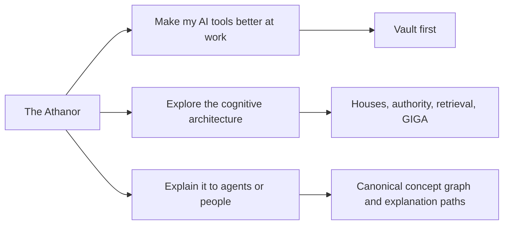
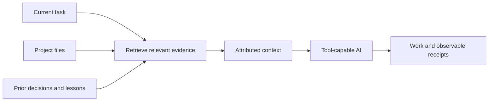
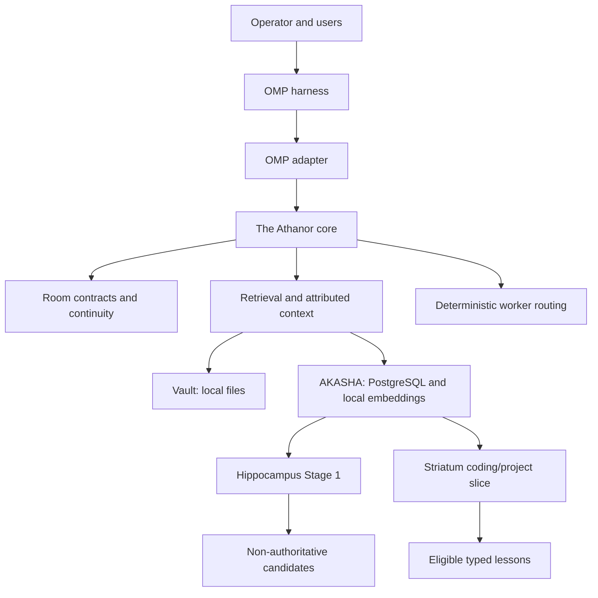
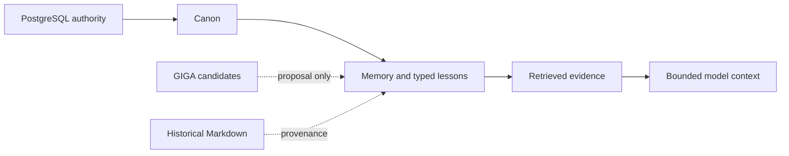

# The Athanor

**Make AI tools better at real work.**

The Athanor gives a tool-capable AI bounded access to the projects, decisions,
lessons, and prior work it needs for the current task. Retrieved material keeps
its source attached. Corrected knowledge can replace stale guidance without
erasing history. The model or provider carrying the work can change without
making the project start from zero again.

**Status:** `0.11.0`, operational late beta. The supported public path is Windows
x64 with [OMP](https://github.com/can1357/oh-my-pi). Vault is usable without a
database, embedding service, or GPU. AKASHA adds the PostgreSQL-backed memory
and knowledge substrate. Other harnesses and platforms are not yet supported
release targets.

## Choose your entrance

The project has one architecture and three useful ways into it:



| You want to… | Start here |
|---|---|
| Give an AI reliable project context and stop repeating the same background | Keep reading, then use [The Athanor for work](./docs/FOR_WORK.md) |
| Inspect the deeper model-space, continuity, and cognitive-infrastructure design | [For latent-space explorers](./docs/FOR_EXPLORERS.md) |
| Explain The Athanor accurately to another agent, teammate, user, or audience | [Explaining The Athanor](./docs/EXPLAINING_THE_ATHANOR.md) |

The older adversarial introduction was not discarded. It moved behind the
second door, where a reader asking for the architectural argument can meet it on
purpose instead of being mugged by the reception desk.

## Better context for ordinary work

A normal user does not need to care about memory theory. They need the AI to
answer questions like:

> Which service owns invoice validation, what decision changed it, and where is
> that documented?

Without a retrieval layer, an agent must guess, reread an arbitrary pile of
files, or ask the operator to reconstruct the project again. The Athanor gives
it a bounded evidence path instead:



The Athanor does not make a model infallible. It makes the context path visible:
which source was selected, which terms or fields matched, what authority the
record has, and where a correction belongs.

## Start with Vault

Vault is the lightweight profile. In the room's `.solarisael-room.json`, point
it at one or several project roots:

```json
{
  "vaultRoots": ["../project-a", "../project-b"],
  "vaultIgnore": ["private/**", "generated/**"],
  "vaultMaxFileBytes": 524288,
  "vaultMaxFiles": 5000
}
```

Vault searches Markdown, JSON, JSONL, and plain text using exact-content and
field-aware BM25F lanes. Results contain bounded excerpts with source path,
heading or record identity, matching fields, selection reasons, and term
coverage. Its index is derived from the configured files and rebuilt as needed.

Vault requires no PostgreSQL, embeddings, or GPU. It excludes common generated
paths and secret-bearing filenames, respects configured ignores and each root's
top-level `.gitignore`, and does not follow symlinks.

Read [Retrieval](./docs/RETRIEVAL.md) for the exact query, attribution, and limit
contracts.

## Grow into AKASHA when the work needs it

AKASHA adds a durable PostgreSQL authority layer, `pgvector`, `pg_trgm`, local
embeddings, typed memory and lesson stores, supersession, chronology, taxonomy,
and governed lifecycle operations.

| Need | Vault | AKASHA |
|---|---:|---:|
| Attributed retrieval over configured project files | Yes | Yes |
| Exact-content and field-aware BM25F lanes | Yes | Yes |
| Database, embedding service, or GPU required | No | PostgreSQL and a compatible embedding service |
| Typed authoritative memories and lessons | No | Yes |
| Hybrid lexical, structured, and semantic retrieval | File retrieval | Yes |
| Supersession without deleting historical records | File-level correction | Yes |
| GIGA candidate and lesson-pressure substrate | No | Yes |

This is a deployment choice, not a maturity contest. Vault can be the complete
answer for a project corpus. AKASHA is for work that needs durable typed
knowledge, deeper continuity, and governed cognitive machinery.

## The current architecture



Authority stays explicit:



In AKASHA, PostgreSQL is authoritative, canon outranks loose memory, and
retrieval rank does not create truth. A GIGA candidate remains a proposal until
an authorized promotion. Anamnesis is counsel, never canon.

Read [Architecture](./docs/ARCHITECTURE.md) for component and data-flow
contracts and [Hippocampus](./docs/HIPPOCAMPUS.md) for candidate authority.

## What exists now

The reference House currently uses:

- Vault and AKASHA retrieval profiles;
- automatic and explicit attributed recall;
- typed memories plus coding, project, writing, design, and audio lessons;
- guarded lesson updates and deletion;
- design-system catalogue read/write organs;
- room-local continuity, state, wake, sleep, and paper boats;
- House commons without collapsing private room memory;
- deterministic worker lanes and room-owned familiar spellbooks;
- Anamnesis reviewed counsel;
- GIGA Hippocampus Stage 1 event, candidate, review, and promotion flow;
- GIGA Striatum's current coding/project lesson-activation slice;
- 26 named OMP organs across retrieval, continuity, counsel, routing, design,
  GIGA review, and House configuration.

The localhost administrative GUI is current. It is not the planned native Godot
client.

## What is not a current release claim

Cingulate, the Athanor Host, the Godot client, NATS delivery, Datalog/Lean proof
paths, OMEGA, ANON, and the signed marketplace remain specified, planned, or
research work. They are not silently counted as shipped capabilities.

The project does not currently claim proven token savings, improved answer
quality, one-click installation, support beyond Windows + OMP, provider-side
privacy, enterprise tenancy, or metaphysical identity continuity.

[Planned Features](./docs/PLANNED_FEATURES.md) is the canonical status map.
[Evidence](./docs/EVIDENCE.md) separates measurements from hypotheses.
[Limitations](./docs/LIMITATIONS.md) names the release boundary.

## Install

One repository and one release own the core, the substrate, the OMP adapter, the
installer, the updater, and these documents. You download one archive and run
one installer.

The supported platform is Windows x64 with OMP and Bun.

Each release publishes two archives for that platform:

```text
the-athanor-<version>-windows-x64-vault.zip
the-athanor-<version>-windows-x64-akasha.zip
```

Pick the Vault archive for the file-attributed profile. It needs no substrate
binary, no PostgreSQL, no embeddings, no WSL, and no Rust runtime.

Pick the AKASHA archive for the durable-memory profile. It adds substrate
operations and the platform substrate binary, and it requires PostgreSQL with
`pgvector`, a local embedding service, and WSL 2.

An install writes three directories under your target directory: `the-athanor`
for product code, `rooms` for your rooms, and `state` for mutable state. It
overwrites nothing else outside `the-athanor`.

A tool-capable installation agent can follow this exact request:

> Install The Athanor with me. Preserve my existing rooms and configuration,
> explain consequential system changes before making them, and verify the
> completed installation.

The installation is staged and verified; it is not advertised as one-click.
Read [Install The Athanor](./INSTALL.md) before changing the host. A 0.10.x
install needs the explicit migration path described there.

## Repository boundaries

| Component | Owns |
|---|---|
| `crates/`, `src/`, `index.ts` | Provider-neutral core contracts, Rust core and protocol crates, Vault retrieval |
| `adapters/omp/` | OMP adapter, lifecycle hooks, localhost administrative GUI, 26 named organs, starter room, installer, updater, verifier, and the portable bundle builder |
| `substrate/` | AKASHA database, migrations, embeddings, typed stores, GIGA runtime, health, deployment, and backups |

All three live in [`solarisael/the-athanor`](https://github.com/solarisael/the-athanor)
and ship in one release. Read
[Repository layout and component ownership](./docs/ARCHITECTURE.md#repository-layout-and-component-ownership)
for the full contract.

The core is designed around provider-neutral contracts. That does not mean every
harness already has a supported adapter.

## Documentation

### Use it

1. [Install](./INSTALL.md)
2. [Daily usage](./USAGE.md)
3. [The Athanor for work](./docs/FOR_WORK.md)
4. [Identity guide](./IDENTITY_GUIDE.md)

### Understand the current system

1. [Architecture](./docs/ARCHITECTURE.md)
2. [Retrieval](./docs/RETRIEVAL.md)
3. [Lessons](./docs/LESSONS.md)
4. [Hippocampus](./docs/HIPPOCAMPUS.md)
5. [Evidence](./docs/EVIDENCE.md)
6. [Security](./docs/SECURITY.md)
7. [Limitations](./docs/LIMITATIONS.md)

### Explore or explain it

- [For latent-space explorers](./docs/FOR_EXPLORERS.md)
- [Explaining The Athanor](./docs/EXPLAINING_THE_ATHANOR.md)
- [The House model and project history](./HOUSE.md)
- [Grouped documentation index](./docs/README.md)

### Follow accepted direction

- [Planned Features](./docs/PLANNED_FEATURES.md) — canonical status map
- [Runtime Architecture](./docs/RUNTIME_ARCHITECTURE.md)
- [Godot Client](./docs/GODOT_CLIENT.md)
- [Synthesis Architecture](./docs/SYNTHESIS_ARCHITECTURE.md)
- [Companion Ecosystem](./docs/COMPANION_ECOSYSTEM.md)

Dated snapshots under [`docs/history/`](./docs/history/) are provenance, not
current release contracts.

## License

The Athanor uses the Apache License 2.0. See [LICENSE](./LICENSE) and
[NOTICE](./NOTICE).
