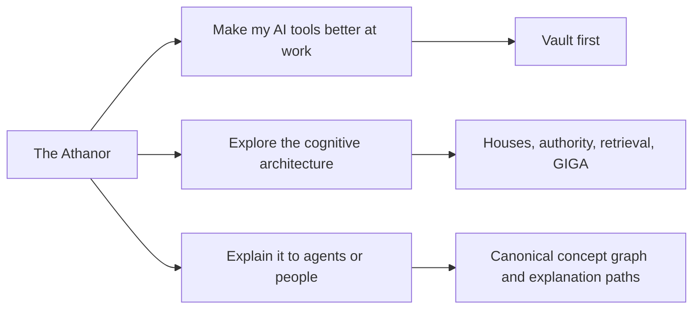
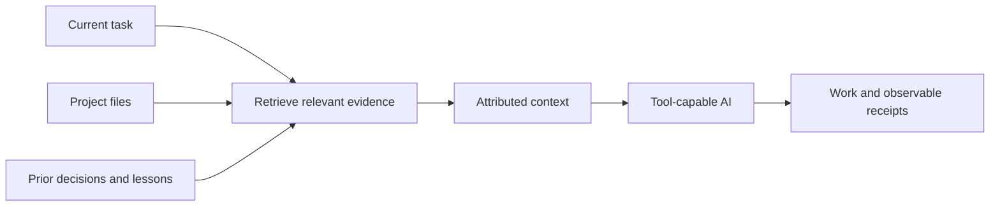
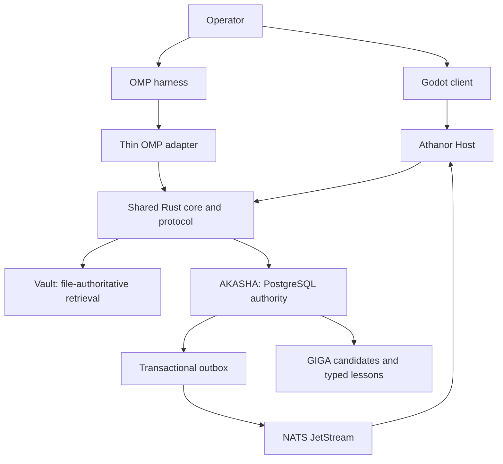
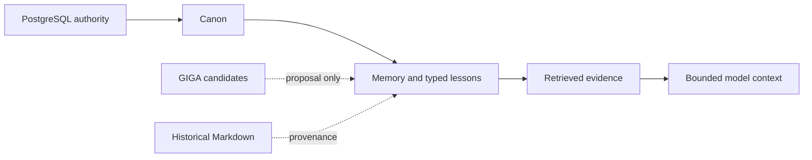

# The Athanor

**Make AI tools better at real work.**

The Athanor gives a tool-capable AI bounded access to the projects, decisions,
lessons, and prior work it needs for the current task. Retrieved material keeps
its source attached. Corrected knowledge can replace stale guidance without
erasing history. The model or provider carrying the work can change without
making the project start from zero again.

**Status:** `1.0.0-rc.2`, native Windows x64 release candidate. OMP is the
supported harness. One Rust workspace owns the behavioral core, Vault retrieval,
AKASHA PostgreSQL authority, Athanor Host, NATS delivery, native lifecycle, and
Godot client. Vault remains database-free; AKASHA adds durable typed memory,
lessons, canon, continuity, and governed background work.
RC2 is installed on the reference Solarisael workstation in external-authority
mode with separate Kintsu and Kodo Hosts and one stable OMP loader.

## Choose your entrance

The project has one architecture and three useful ways into it:



| You want to… | Start here |
|---|---|
| Give an AI reliable project context and stop repeating the same background | Keep reading, then use [The Athanor for work](./docs/FOR_WORK.md) |
| Inspect the deeper model-space, continuity, and cognitive-infrastructure design | [For latent-space explorers](./docs/FOR_EXPLORERS.md) |
| Explain The Athanor accurately to another agent, teammate, user, or audience | [Explaining The Athanor](./docs/EXPLAINING_THE_ATHANOR.md) |

The older adversarial introduction was not discarded. It moved behind the
second door, where a reader asking for the architectural argument can meet it on
purpose instead of being mugged by the reception desk.

## Better context for ordinary work

A normal user does not need to care about memory theory. They need the AI to
answer questions like:

> Which service owns invoice validation, what decision changed it, and where is
> that documented?

Without a retrieval layer, an agent must guess, reread an arbitrary pile of
files, or ask the operator to reconstruct the project again. The Athanor gives
it a bounded evidence path instead:



The Athanor does not make a model infallible. It makes the context path visible:
which source was selected, which terms or fields matched, what authority the
record has, and where a correction belongs.

## Start with Vault

Vault is the lightweight profile. In the room's `.solarisael-room.json`, point
it at one or several project roots:

```json
{
  "vaultRoots": ["../project-a", "../project-b"],
  "vaultIgnore": ["private/**", "generated/**"],
  "vaultMaxFileBytes": 524288,
  "vaultMaxFiles": 5000
}
```

Vault searches Markdown, JSON, JSONL, and plain text using exact-content and
field-aware BM25F lanes. Results contain bounded excerpts with source path,
heading or record identity, matching fields, selection reasons, and term
coverage. Its index is derived from the configured files and rebuilt as needed.

Vault requires no PostgreSQL, embeddings, or GPU. It excludes common generated
paths and secret-bearing filenames, respects configured ignores and each root's
top-level `.gitignore`, and does not follow symlinks.

Read [Retrieval](./docs/RETRIEVAL.md) for the exact query, attribution, and limit
contracts.

## Grow into AKASHA when the work needs it

AKASHA adds a durable PostgreSQL authority layer, `pgvector`, `pg_trgm`, local
embeddings, typed memory and lesson stores, supersession, chronology, taxonomy,
and governed lifecycle operations.

| Need | Vault | AKASHA |
|---|---:|---:|
| Attributed retrieval over configured project files | Yes | Yes |
| Exact-content and field-aware BM25F lanes | Yes | Yes |
| Database, embedding service, or GPU required | No | PostgreSQL and a compatible embedding service |
| Typed authoritative memories and lessons | No | Yes |
| Hybrid lexical, structured, and semantic retrieval | File retrieval | Yes |
| Supersession without deleting historical records | File-level correction | Yes |
| GIGA candidate and lesson-pressure substrate | No | Yes |

This is a deployment choice, not a maturity contest. Vault can be the complete
answer for a project corpus. AKASHA is for work that needs durable typed
knowledge, deeper continuity, and governed cognitive machinery.

## The current architecture



Authority stays explicit:



In AKASHA, PostgreSQL is authoritative, canon outranks loose memory, and
retrieval rank does not create truth. A GIGA candidate remains a proposal until
an authorized promotion. Anamnesis is counsel, never canon.

Read [Architecture](./docs/ARCHITECTURE.md) for component and data-flow
contracts and [Hippocampus](./docs/HIPPOCAMPUS.md) for candidate authority.

## What exists now

The `1.0.0-rc.2` candidate includes:

- one shared Rust contract layer and Rust-owned Vault/AKASHA behavior;
- strict database-free Vault retrieval with attributed bounded evidence;
- PostgreSQL-authoritative canon, memory, typed lessons, continuity, and GIGA;
- typed Paper Boat sleep/wake with transaction-coupled `boat.ready` outbox rows;
- NATS JetStream delivery carrying only bounded sanitized pointers and receipts;
- an authenticated localhost Athanor Host with persisted snapshots, typed
  deltas, resynchronization, idempotency, and restart recovery;
- a Godot 4.7.1 client with live Recall Policy and sanitized Paper Boat receipt
  screens;
- one native Windows service supervisor, installer, updater/rollback path,
  doctor, uninstall, and explicit purge boundary;
- 26 named OMP organs whose adapter delegates behavioral authority to Rust.

## What is not a 1.0 release claim

The in-world 3D room, Datalog/Lean proof paths, Cingulate, OMEGA, ANON, Relay,
group rooms, and the signed marketplace remain specified, planned, or research
work. They are not counted as shipped behavior.

The release candidate does not claim proven token savings, improved answer
quality, support beyond Windows x64 + OMP, provider-side privacy, enterprise
tenancy, or clean-machine installation evidence. The native installer is built
and locally verified; clean-machine installation remains a separate public
evaluation.


[Planned Features](./docs/PLANNED_FEATURES.md) is the canonical status map.
[Evidence](./docs/EVIDENCE.md) separates measurements from hypotheses.
[Limitations](./docs/LIMITATIONS.md) names the release boundary.

## Install

One repository and one release own the substrate, Host, delivery, OMP adapter,
Godot client, installer, updater, and install contract.

The supported ordinary package is one checksum-published native Windows x64
installer:

```text
The-Athanor-<version>-windows-x64.exe
The-Athanor-<version>-windows-x64.exe.sha256
```

It carries the Rust runtime binaries, Godot 4.7.1, EnterpriseDB PostgreSQL
18.4-2 with pgvector 0.8.6, and NATS Server 2.14.4. The installed service needs
no WSL, Python, Bun, Cargo, Godot editor, or separately installed database/broker.
PostgreSQL remains the durable AKASHA authority; Vault retrieval remains
available as a runtime capability rather than a separate package.

Immutable product versions live under
`%ProgramFiles%\Solarisael\Athanor\versions`. Mutable databases, rooms, backups,
configuration, logs, and ACL-restricted secrets live under
`%ProgramData%\Solarisael\Athanor` and survive ordinary uninstall. An explicit
advanced mode uses an operator-provided external PostgreSQL 18 + pgvector 0.8.6
database while retaining the other packaged components.

Installation verifies every staged artifact before activation, backs up before
upgrade, runs ordered migrations, and requires Windows service readiness.
Rollback uses the retained version pointer and pre-change database backup. A
bounded legacy pre-install door only imports and backs up named 0.10.x trees; no
legacy runtime is retained.

Read [Install The Athanor](./INSTALL.md) for checksum verification, exact
topology, external-database configuration, rollback, uninstall, and explicit
purge contracts.

## Repository boundaries

| Component | Owns |
|---|---|
| `crates/house-core`, `crates/house-protocol` | Provider-neutral domain and wire contracts |
| `crates/house-vault`, `crates/house-substrate` | File-authoritative Vault and PostgreSQL-authoritative AKASHA behavior |
| `crates/house-host`, `crates/house-delivery` | Authenticated client projection and narrow JetStream delivery |
| `crates/athanor-install`, `installer/` | Native lifecycle, immutable release staging, and Windows installer |
| `clients/godot/` | Thin Godot operator client; no direct database or broker authority |
| `adapters/omp/` | OMP lifecycle hooks and named tool surface delegated to Rust |

All three live in [`solarisael/the-athanor`](https://github.com/solarisael/the-athanor)
and ship in one release. Read
[Repository layout and component ownership](./docs/ARCHITECTURE.md#repository-layout-and-component-ownership)
for the full contract.

The core is designed around provider-neutral contracts. That does not mean every
harness already has a supported adapter.

## Documentation

### Use it

1. [Install](./INSTALL.md)
2. [Daily usage](./USAGE.md)
3. [The Athanor for work](./docs/FOR_WORK.md)
4. [Identity guide](./IDENTITY_GUIDE.md)

### Understand the current system

1. [Architecture](./docs/ARCHITECTURE.md)
2. [Retrieval](./docs/RETRIEVAL.md)
3. [Lessons](./docs/LESSONS.md)
4. [Hippocampus](./docs/HIPPOCAMPUS.md)
5. [Evidence](./docs/EVIDENCE.md)
6. [Security](./docs/SECURITY.md)
7. [Limitations](./docs/LIMITATIONS.md)

### Explore or explain it

- [For latent-space explorers](./docs/FOR_EXPLORERS.md)
- [Explaining The Athanor](./docs/EXPLAINING_THE_ATHANOR.md)
- [The House model and project history](./HOUSE.md)
- [Grouped documentation index](./docs/README.md)

### Follow accepted direction

- [Changelog](./CHANGELOG.md) — notable changes through the `1.0.0-rc.2` candidate
- [Planned Features](./docs/PLANNED_FEATURES.md) — canonical status map
- [Runtime Architecture](./docs/RUNTIME_ARCHITECTURE.md)
- [Godot Client](./docs/GODOT_CLIENT.md)
- [Synthesis Architecture](./docs/SYNTHESIS_ARCHITECTURE.md)
- [Companion Ecosystem](./docs/COMPANION_ECOSYSTEM.md)

Dated snapshots under [`docs/history/`](./docs/history/) are provenance, not
current release contracts.

## License

The Athanor uses the Apache License 2.0. See [LICENSE](./LICENSE) and
[NOTICE](./NOTICE).
