# The Athanor Code Flow Map

This document maps the current first-party code by ownership, call boundary, and
runtime order. It is a source map, not a target-architecture proposal. Each
large path is split into a small diagram so that a reader can follow one event
without crossing the whole repository at once.

**Snapshot:** current working tree on 2026-08-17.

**Scope:** production Rust, the OMP adapter, authored Godot code, and operational
build/install scripts. Tests are proof satellites rather than runtime nodes.
`gui/addons/juicee/` is one third-party plugin boundary. `gui-prototype/` is a
standalone mock/specimen and has no production runtime edge.

## Reading the map

- Solid arrows are runtime calls, messages, data movement, or strict startup
  order.
- Dashed arrows are optional integrations, proof surfaces, or non-product labs.
- PostgreSQL is authoritative for AKASHA state. Vault files are authoritative
  only in the Vault profile. NATS carries delivery; it is not a second database.
- Function names appear where they define a cross-module transition. Small pure
  helpers remain in the module index instead of becoming graph noise.

## 1. Whole runtime

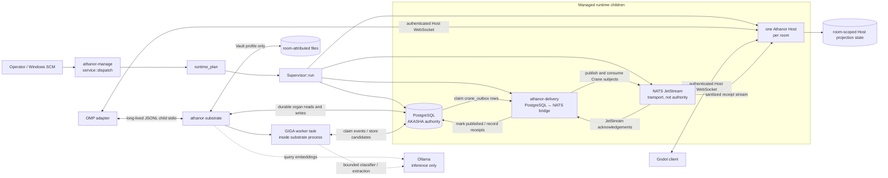

Startup order is PostgreSQL when managed, then NATS, delivery, and one Host per
configured room. Shutdown drains the same process plan in reverse. OMP can use
both boundaries: Host commands for interactive room state and substrate JSONL
for durable organs. Godot uses Host only.

NATS never opens a PostgreSQL connection. `athanor-delivery` is the
transactional-outbox bridge: it claims durable rows from PostgreSQL, publishes
them to JetStream, consumes delivered events, and records authoritative receipts
back in PostgreSQL.

GIGA's queue events, candidates, review transitions, and promotions are durable
PostgreSQL state. The worker runs inside the substrate process and calls Ollama
only for bounded classification or extraction. Ollama holds neither the GIGA
queue nor candidate authority.

Sources: `crates/athanor-install/src/service.rs`,
`crates/athanor-install/src/native_runtime.rs`,
`crates/athanor-install/src/supervisor.rs`, `crates/house-host/src/server.rs`,
`adapters/omp/rust-transport.ts`, `gui/src/host_session.rs`.

## 2. Rust workspace dependency DAG

Arrows point from a crate to its internal workspace dependency.

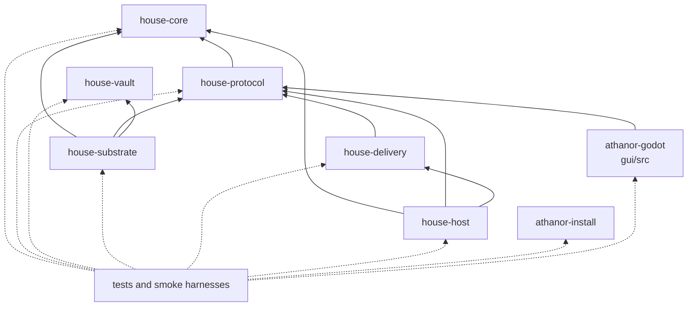

`house-core`, `house-vault`, and `athanor-install` have no internal workspace
crate dependency. Repository proximity does not erase authority boundaries:
Vault stays database-free, and the core does not import an adapter.

Source: workspace manifests resolved from `Cargo.toml` and each crate manifest.

## 3. Service boot and shutdown

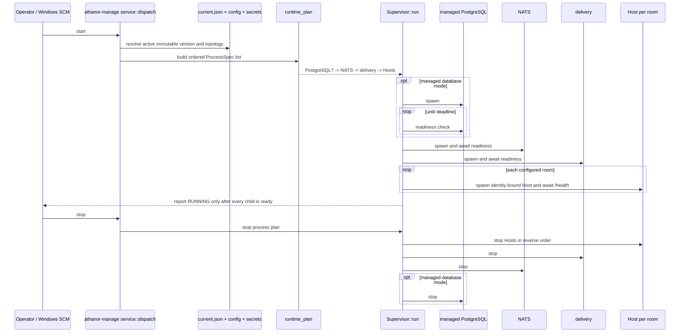

A child spawn is not readiness. Failure before the full plan becomes ready is a
service-start failure, not a partial success.

Sources: `crates/athanor-install/src/service.rs`,
`crates/athanor-install/src/native_runtime.rs`,
`crates/athanor-install/src/supervisor.rs`.

## 4. One OMP context turn

The ordering below is the `pi.on("context")` path. Conversation capture occurs
before memo replay so detached GIGA ingestion is not skipped by a cache hit.

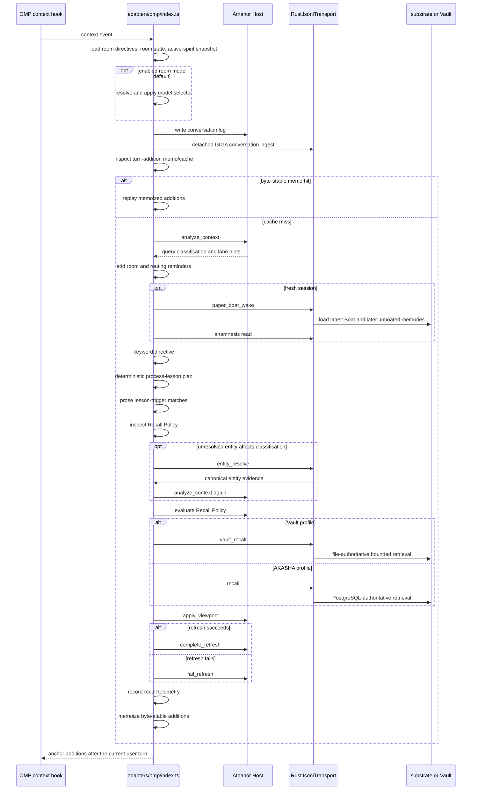

Related lifecycle hooks:

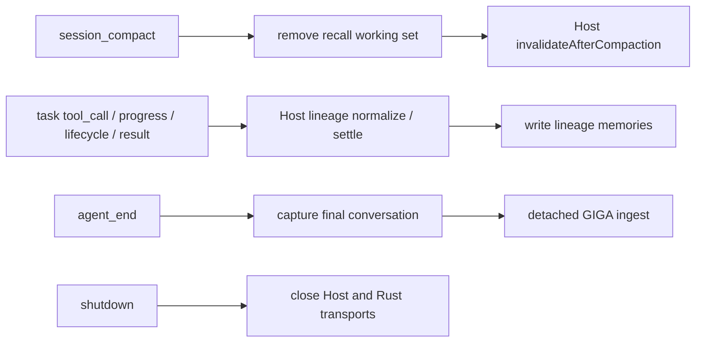

Sources: `adapters/omp/index.ts`, `adapters/omp/giga.ts`,
`adapters/omp/kitten-lineage.ts`, and `adapters/omp/solarisael-house-proof/`.

## 5. OMP tool ownership and transport

The current adapter registers 35 tools. A tool name is not an authority claim;
the owner column names the boundary that actually performs or persists the
operation.

| Tool | Runtime owner / boundary |
|---|---|
| `recall` | Rust JSONL -> substrate `recall` or `vault_recall` routing |
| `canon_read` | Rust JSONL -> PostgreSQL canon store |
| `canon_write` | Rust JSONL -> guarded PostgreSQL canon write |
| `remember` | Rust JSONL -> typed lesson transaction or memory transaction |
| `delete_lesson` | Rust JSONL -> lesson store mutation |
| `update_lesson` | Rust JSONL -> lesson store mutation |
| `wake` | Rust JSONL -> `paper_boat_wake` |
| `room_state` | Adapter -> room-state file |
| `set_room_state` | Adapter -> room-state file plus `active_spirit.md` snapshot |
| `lessons` | Rust JSONL -> typed lesson query |
| `design_doc` | Rust JSONL -> design-document query |
| `design_doc_write` | Rust JSONL -> guarded design-document write |
| `sleep` | Adapter flushes GIGA buffer, then Rust JSONL -> `paper_boat_sleep` |
| `house_lane_status` | Host lane status plus substrate health probe |
| `familiar_status` | Host routing boundary plus room spellbook file |
| `familiar_dispatch` | Host routing boundary plus room spellbook; returns a packet only |
| `house_dispatch` | Host routing boundary; returns a packet only |
| `house_routing_mode` | Adapter -> room-state file |
| `kitten_lineage_status` | Adapter-local lifecycle diagnostics |
| `recall_policy` | authenticated Host Recall Policy command |
| `house_model_default` | Adapter -> room-state file and current OMP model resolver |
| `anamnesis` | Rust JSONL -> PostgreSQL Anamnesis read |
| `anamnesis_write` | Rust JSONL -> guarded PostgreSQL Anamnesis write |
| `giga_candidate_list` | Rust JSONL -> GIGA candidate store |
| `giga_health` | Rust JSONL -> GIGA queue/store health |
| `giga_queue_maintenance` | Rust JSONL -> bounded GIGA queue maintenance |
| `giga_review` | Rust JSONL -> trusted GIGA review transition |
| `giga_promote_memory` | Rust JSONL -> transactional memory promotion |
| `giga_promote_coding_lesson` | Rust JSONL -> transactional coding-lesson promotion |
| `giga_promote_project_lesson` | Rust JSONL -> consent-gated project-lesson promotion |
| `hallway_create` | Rust JSONL -> Hallway store |
| `hallway_join` | Rust JSONL -> Hallway store |
| `hallway_post` | Rust JSONL -> Hallway store |
| `hallway_read` | Rust JSONL -> Hallway store |
| `hallway_inbox` | Rust JSONL manual read; Host-owned automatic projection |
| `hallway_knock_policy` | Rust JSONL -> append-only room-owned Hallway wake policy |
| `hallway_knock` | Rust JSONL -> bounded Hallway Knock lifecycle |

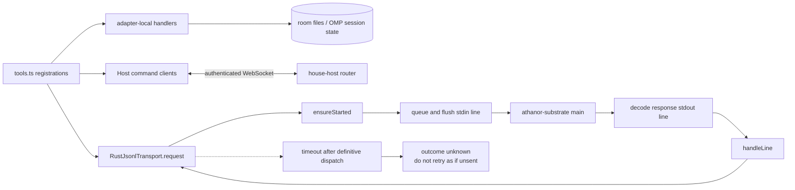

`RustJsonlTransport` keeps one child process alive and correlates JSONL request
IDs. A timeout after dispatch is explicitly outcome-unknown because replaying a
write could duplicate an operation whose response was merely lost.

Hallway Knock actuation follows a separate local path. The recipient Host claims
one PostgreSQL pointer under a short session lease; the OMP doorman includes only
trusted routing IDs in its custom wake message and invokes `pi.sendMessage` for
one turn. The spirit reads the exact Hallway message through the ordinary
untrusted social path. Started/completed/failed settlement returns through Host;
claiming never advances a Hallway read cursor or clears a Bell row.

Sources: `adapters/omp/solarisael-house-proof/tools.ts`,
`adapters/omp/rust-transport.ts`, `adapters/omp/solarisael-house-proof/host.ts`.

## 6. Substrate request router

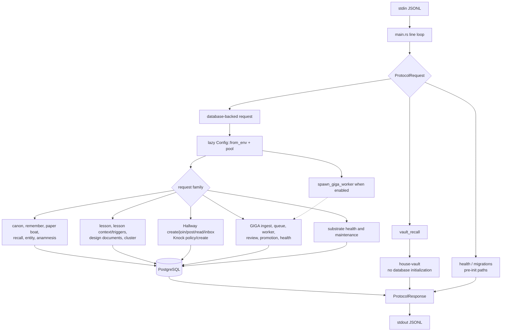

The main binary owns protocol dispatch and lazy shared state. Domain modules own
the transactions; `main.rs` does not become a second implementation of their
rules.

Sources: `crates/house-substrate/src/main.rs`, `lib.rs`, `config.rs`,
`health.rs`, and the domain modules listed in the module index.

## 7. Recall paths

### AKASHA profile

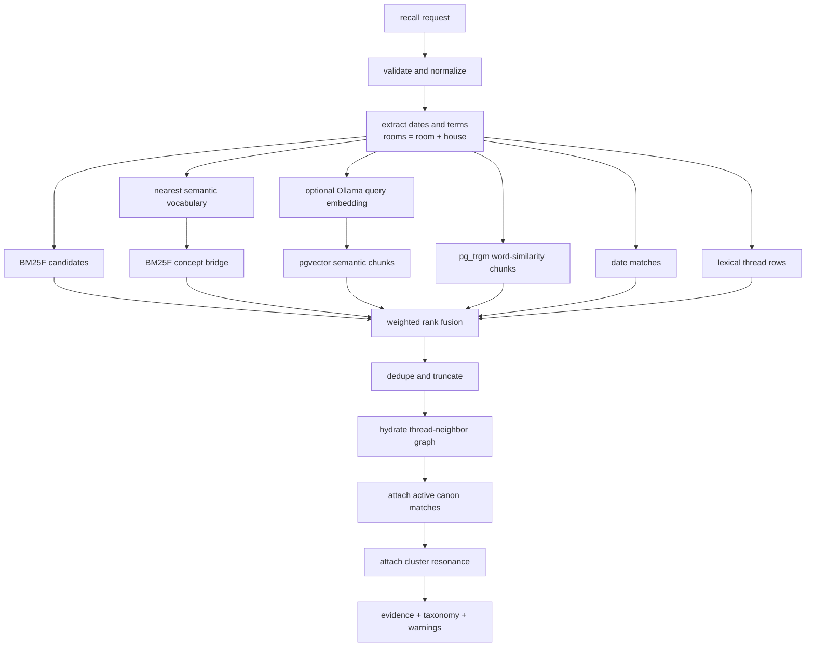

### Vault profile

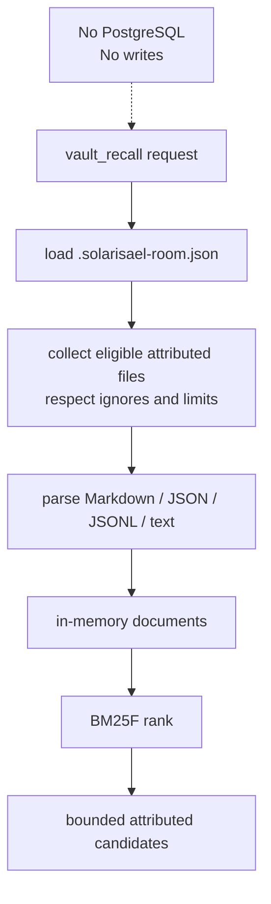

Sources: `crates/house-substrate/src/recall.rs`,
`crates/house-substrate/src/bm25f.rs`, `crates/house-vault/src/lib.rs`.

## 8. Host command cycle

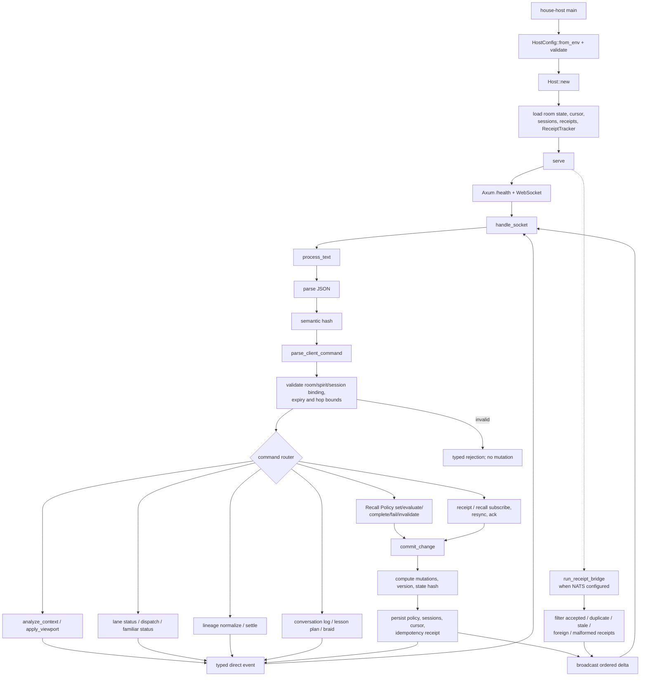

Sources: `crates/house-host/src/main.rs`, `config.rs`, `server.rs`, `policy.rs`,
`store.rs`, `receipt.rs`, `viewport.rs`.

## 9. Paper Boat, Crane delivery, and receipt projection

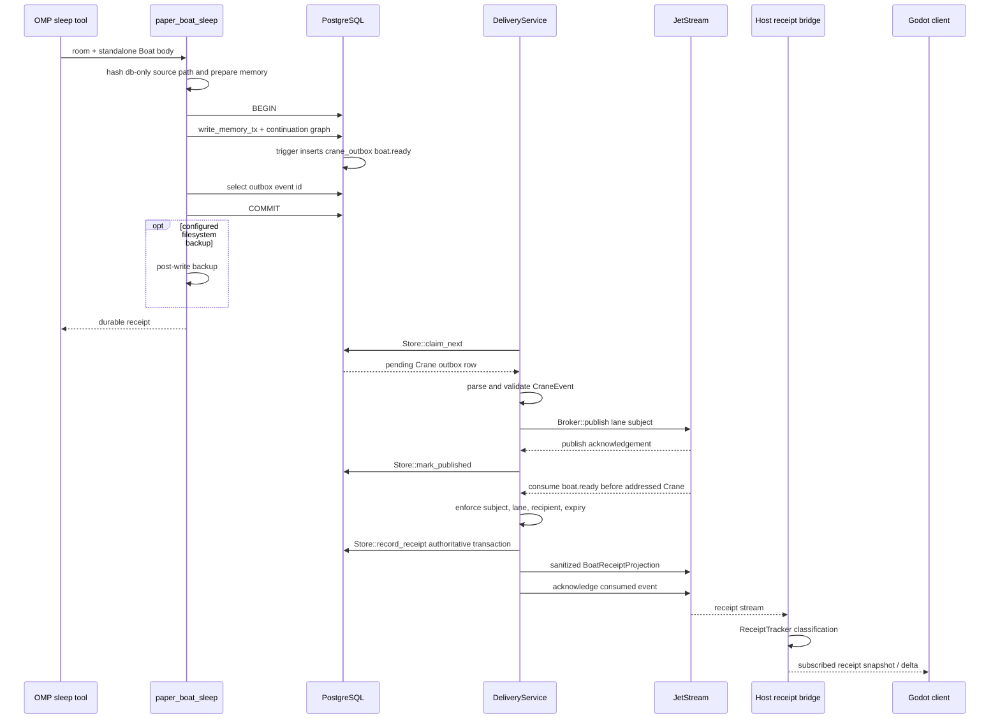

`paper_boat_wake` does not trust a NATS payload as continuity. It reloads the
latest complete Boat from PostgreSQL and adds a bounded set of later unboated
memories. Duplicate delivery replays safely; poison events dead-letter and
transient failures nack within bounded retry policy.

Sources: `crates/house-substrate/src/paper_boat.rs`, migrations `0016` and
`0017` in `crates/house-substrate/src/migrations.rs`,
`crates/house-delivery/src/`, `crates/house-host/src/receipt.rs`.

## 10. GIGA candidate lifecycle

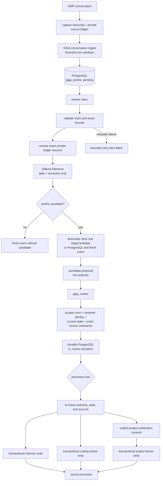

A candidate never becomes evidence merely because the worker extracted it.
Review and promotion are separate durable transitions. Project lessons add an
operator publication-consent gate.

Sources: `adapters/omp/giga.ts`, `crates/house-substrate/src/giga.rs`,
`crates/house-substrate/src/giga_worker.rs`,
`crates/house-core/src/conversation.rs`.

## 11. Native release, install, rollback, and removal

### Release assembly

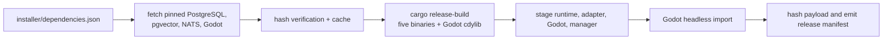

### Install or update

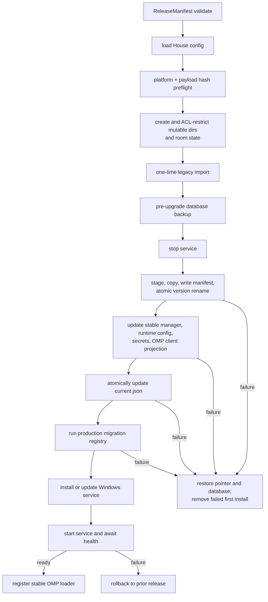

### Explicit rollback and removal

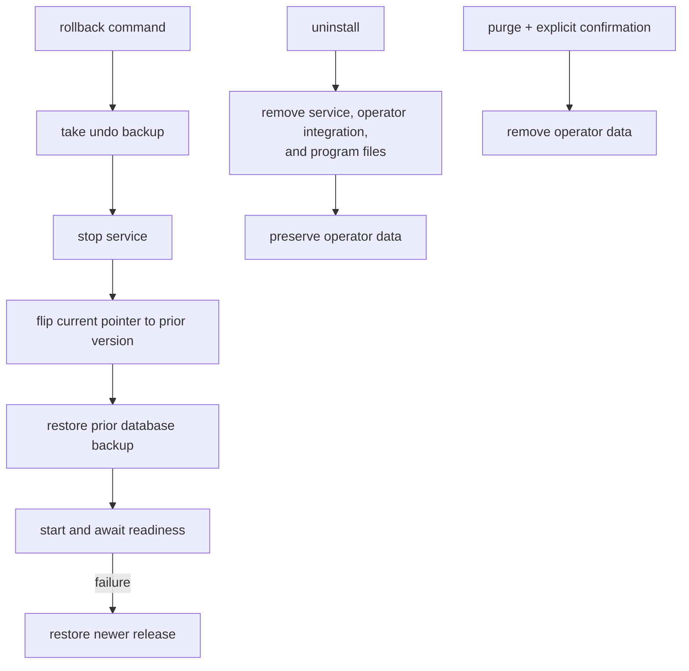

Sources: `installer/build-native-release.ps1`,
`installer/native-build-cache.ps1`, `crates/athanor-install/src/installer.rs`,
`manifest.rs`, `layout.rs`, `boundaries.rs`, `omp.rs`, `service.rs`, and
`supervisor.rs`.

## 12. Godot client and authored UI

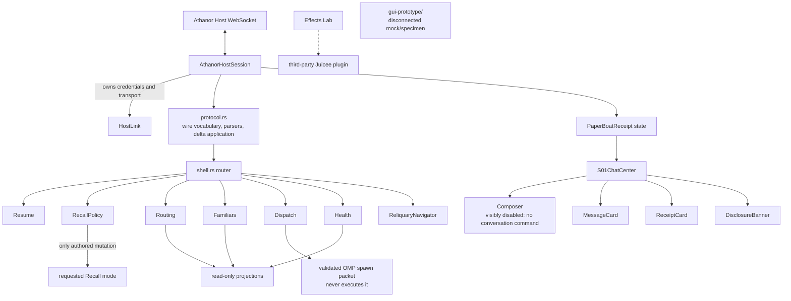

The Rust extension owns Host protocol state. GDScript composes the visible
instrument. Generic design-system components present state but do not gain
persistence or transport authority. The composer remains disabled because the
Host protocol does not implement a conversation-send command.

Sources: `gui/src/`, `gui/screens/s01_chat_center.gd`,
`gui/design-system/components/`, `gui/navigation/reliquary_navigator.gd`,
`gui/effects_lab/effects_lab.gd`, `gui/main.tscn`.

## 13. Module ownership index

### Rust production modules: 64

| Crate | Modules | Boundary |
|---|---|---|
| `house-core` (8) | `lib`, `context`, `conversation`, `hallway`, `lesson_triggers`, `lineage`, `routing`, `triggers` | Provider-neutral domain types; context classification; transcript/source identity; Hallway validation; trigger compilation; quest normalization; lane and dispatch contracts |
| `house-protocol` (2) | `lib`, `host` | Substrate JSONL DTOs/results/errors and Host command/event envelopes |
| `house-vault` (1) | `lib` | Strict file-authoritative, database-free Vault retrieval |
| `house-substrate` (19) | `lib`, `main`, `config`, `state`, `migrations`, `backup`, `health`, `remember`, `recall`, `bm25f`, `canon`, `entity`, `anamnesis`, `lesson`, `cluster`, `paper_boat`, `hallway`, `giga`, `giga_worker` | JSONL dispatch, PostgreSQL configuration and migrations, durable organs, retrieval, GIGA, backup, and health |
| `house-delivery` (5) | `lib`, `main`, `model`, `broker`, `store` | Crane envelope validation, PostgreSQL outbox/receipt store, JetStream publication and consumption |
| `house-host` (8) | `lib`, `main`, `config`, `server`, `policy`, `store`, `receipt`, `viewport` | Authenticated client boundary, room projection state, Recall Policy, ordered deltas, receipt bridge, viewport shaping |
| `athanor-install` (10) | `lib`, `main`, `layout`, `manifest`, `boundaries`, `installer`, `native_runtime`, `omp`, `service`, `supervisor` | Installed layout, release validation, transactional update/rollback, runtime planning, Windows service, OMP integration |
| `athanor-godot` (11) | `lib`, `host_link`, `host_session`, `protocol`, `shell`, `recall_policy`, `routing`, `familiar_status`, `dispatch`, `health`, `paper_boat_receipt` | Thin native client transport, exact Host wire contract, projections, shell routes, and Paper Boat receipt state |

### OMP adapter modules: 27

| Area | Modules | Boundary |
|---|---|---|
| Adapter entry and loading | `index.ts`, `athanor-root.ts`, `installed-loader.ts`, `discovery.ts` | OMP registration, installed-source resolution, room discovery, lifecycle hooks |
| Transport and capture | `rust-transport.ts`, `giga.ts`, `kitten-lineage.ts` | Long-lived substrate child, transcript/source-ledger ingestion, task lifecycle bridge |
| Standalone guard | `hygiene.ts` | Repository/packaging hygiene check; not a session runtime import |
| House proof runtime | `tools.ts`, `host.ts`, `context.ts`, `recall-policy.ts`, `recall.ts`, `substrate.ts`, `room.ts`, `conversation-log.ts`, `lesson-triggers.ts`, `lesson-context.ts`, `triggers.ts`, `routing.ts`, `lineage.ts`, `entity-resolution.ts`, `anamnesis.ts`, `recall-telemetry.ts`, `feedback.ts`, `text.ts`, `constants.ts` | Tool registration, Host clients, context assembly, retrieval routing, room files, lessons, lineage, entity handling, telemetry, and shared text/constants |

### Authored Godot GDScript

| Area | Modules | Boundary |
|---|---|---|
| Product screen | `screens/s01_chat_center.gd` | S01 composition and visible session/receipt state |
| Navigation | `navigation/reliquary_navigator.gd` | Shell navigation projection |
| Design components | `receipt_card`, `consequence_button`, `composer`, `message_card`, `evidence_card`, `status_channel`, `text_action`, `disclosure_banner`, `field_row`, `reliquary_panel`, `page_header`, `ritual_surface` | Presentation components; no persistence or transport authority |
| Effects lab | `effects_lab/effects_lab.gd` | Separate visual experiment using the external Juicee plugin |
| External plugin | `addons/juicee/` | Third-party effect implementation treated as one dependency node |
| Proof satellites | `navigation/tests/`, `screens/tests/`, `effects_lab/tests/` | Godot smoke and contract checks; not runtime ownership |

### Operational surfaces

| Path | Responsibility |
|---|---|
| `installer/build-native-release.ps1` | Fetch, verify, compile, stage, import, hash, and assemble a native payload |
| `installer/native-build-cache.ps1` | Deterministic dependency cache used by release assembly |
| `installer/athanor.iss` | Windows installer packaging |
| `substrate/deploy-local.ps1` | Local substrate deployment helper |
| `substrate/state_paths.sh` | Shared local state-path resolution for substrate operations |
| `.github/workflows/` | CI and release proof; not runtime |
| `tests/`, crate tests, `substrate/tests/` | Cross-boundary proof satellites |
| `gui-prototype/` | Disconnected HTML/CSS/JS mock and design specimen |

## 14. Fast traversal paths

- **A prompt gains continuity:** section 4 -> section 5 -> section 6 -> section 7
  -> section 8 -> back to the OMP context.
- **A Boat becomes visible in Godot:** section 9 -> Host receipt bridge in section
  8 -> Godot receipt projection in section 12.
- **A conversation proposes durable knowledge:** section 4 capture -> section 10
  candidate/review/promotion -> substrate transaction in section 6.
- **The installed system starts:** section 11 install -> section 3 service plan ->
  section 1 runtime topology.
- **A worker is selected:** OMP tool table -> Host routing family in section 8 ->
  returned spawn packet; the main model still invokes the OMP task tool explicitly.
