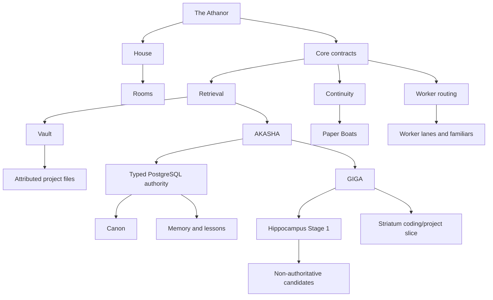
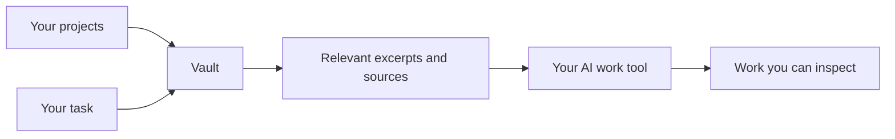

# Explaining The Athanor

This page is for an AI agent or person who needs to explain The Athanor to a
peer, operator, user, engineer, or decision-maker without inventing a different
product for each audience.

Use the same canonical graph every time. Change the traversal order and depth,
not the definitions.

## Canonical one-sentence explanation

> The Athanor is infrastructure that gives AI tools bounded, attributed access
> to project knowledge and, when needed, durable governed continuity that can
> survive closed sessions and changing model processes.

For an ordinary work user, lead with better project context. For an agent-systems
engineer, lead with authority and cognitive offloading. Do not lead either group
through concepts they do not need yet.

## The concept graph



## Definitions that must remain stable

### The Athanor

The platform and core architecture. It defines continuity, retrieval, authority,
routing, and extension contracts. Its current supported public harness is OMP.
Provider-neutral core contracts do not imply that other harness adapters are
already supported.

### House

One sovereign continuity domain. A House can contain multiple rooms and shared
work knowledge without erasing room boundaries. A House is not required merely
to search a project corpus through Vault.

### Room

A bounded line of identity, relationship, context, and continuity within a
House. Rooms prevent every memory and interaction from becoming one undifferentiated
assistant history.

### Vault

The lightweight file-backed retrieval profile. It searches configured Markdown,
JSON, JSONL, and plain-text roots with exact-content and field-aware BM25F lanes.
It returns bounded attributed excerpts and requires no database, embeddings, or
GPU.

### AKASHA

The PostgreSQL-backed authority and retrieval profile. It adds `pgvector`,
`pg_trgm`, compatible local embeddings, typed stores, chronology, supersession,
taxonomy, semantic and structured retrieval, and the substrate used by GIGA.

### Canon

Current authoritative truth in AKASHA. Canon outranks loose memory. A retrieval
score cannot promote a record into canon.

### Memory and lessons

Memory carries durable continuity with provenance and lifecycle. Lessons are
typed reusable knowledge: coding, project, writing, design, and audio. They have
their own eligibility and guarded-write contracts.

### GIGA

Grounded Indexing and Generative Annotation: the cognitive layer above AKASHA,
not another storage profile. Hippocampus Stage 1 produces grounded,
non-authoritative candidates for review. Striatum's current slice activates
eligible coding and project lessons. Candidates do not become truth by existing.

### Organs

Named deterministic tools of a House. The supported OMP adapter currently
mounts 26 across memory, retrieval, lessons, continuity, counsel, routing,
design-system catalogues, GIGA review, and House configuration. An organ is not
an autonomous agent.

### Paper Boat

A compact living handoff from one closed session to the next waking session in
the same room. It is continuity, not the entire memory map.

## Explain it to a work user

Lead with the problem they can see:

> Your AI tool only works with the context it has. The Athanor can search one or
> several project corpora, return the relevant passages with their sources, and
> preserve important decisions when you opt into its durable memory profile.

Then show this path:



Mention AKASHA only if the user needs durable typed decisions, semantic recall,
lessons, chronology, or a larger governed archive.

Do not begin with latent space, sovereign identity, GIGA anatomy, or future
marketplaces. Those are not required to understand the immediate work value.

## Explain it to an AI or agent-systems engineer

Lead with the architectural distinction:

> The Athanor separates model judgment from continuity, retrieval, authority,
> provenance, and repeated deterministic cognition. The active model is a
> replaceable body operating inside those contracts, not the database of truth.

Then explain:

1. Vault supplies attributed project retrieval without infrastructure weight.
2. AKASHA supplies typed PostgreSQL authority and hybrid retrieval.
3. Canon, memory, lessons, candidates, and counsel have different authority.
4. GIGA may propose; authorized lifecycle operations decide what becomes
   durable.
5. Repeated known cognitive work should become an organ rather than another
   prompt ritual.

Continue with [For latent-space explorers](./FOR_EXPLORERS.md).

## Explain it to another agent that must use it

Give the agent this traversal:

```text
Need current project facts?
  → recall through Vault or AKASHA
  → preserve source, heading/record, authority, and selection reasons

Need durable continuity?
  → remember through the authorized store
  → make the body stand alone; source paths are provenance, not substance

Need reusable practice?
  → query the typed lesson store before risky work
  → respect project, type, stage, register, and scope eligibility

Need candidate review?
  → treat GIGA output as a proposal
  → review and promote explicitly; never cite a candidate as authority

Need work delegation?
  → resolve a bounded worker lane or familiar
  → inspect the packet; the harness performs the spawn
```

The agent should read [Usage](../USAGE.md) for operation names and
[Architecture](./ARCHITECTURE.md) for authority boundaries before teaching
behavior it has not verified.

## A thirty-second explanation

> The Athanor makes AI tools more reliable on real projects by controlling how
> they receive context. Vault can search local project files and return bounded
> excerpts with exact attribution without needing a database or GPU. AKASHA adds
> PostgreSQL-backed memory, typed lessons, semantic retrieval, corrections, and
> governed cognitive workers. The model can change; the sources, authority, and
> continuity contracts remain inspectable.

## A two-minute explanation

> Most AI tools either forget between sessions or recover context by dumping
> files, transcript summaries, and vector-search results into a prompt. That can
> retrieve useful text, but it does not distinguish current truth from stale
> memory or a machine-generated suggestion.
>
> The Athanor supplies that missing structure. Its Vault profile is the small
> path: point it at one or several Markdown, JSON, JSONL, or text corpora and it
> returns relevant bounded excerpts with source and match attribution. Its
> AKASHA profile adds a PostgreSQL authority layer, typed memories and lessons,
> semantic retrieval, chronology, supersession, and GIGA workers whose output is
> explicitly non-authoritative until reviewed.
>
> A House is the sovereign continuity boundary; rooms keep identities and
> relationships separate inside it. Deterministic organs handle known mechanics
> such as retrieval, validation, lifecycle, and routing so models can spend
> judgment on ambiguity and novel work. Today the only supported release target
> is Windows x64 with OMP. Several larger components—including the Host, Godot client,
> Cingulate, NATS delivery, OMEGA, and ANON—remain roadmap rather than shipped
> claims.

## Misconceptions to reject

Do not describe The Athanor as:

- merely a chatbot memory plugin;
- a vector database with mythology around it;
- a multi-agent orchestration framework whose main purpose is spawning agents;
- a claim that a model process possesses metaphysical personal continuity;
- an enterprise knowledge platform already supporting teams and tenancy;
- a privacy layer that prevents model providers from seeing prompts;
- a cross-platform, one-click, harness-agnostic release today;
- a finished Godot application;
- a system where GIGA candidates, retrieved memories, or Anamnesis counsel are
  automatically authoritative.

Also do not collapse these pairs:

| Keep distinct | Why |
|---|---|
| Vault / AKASHA | File authority and typed database authority are different deployment contracts |
| retrieval / truth | Relevance ranking does not create authority |
| model body / room identity | A process carrying context is not the continuity contract itself |
| candidate / memory | Generation is not promotion |
| counsel / canon | Useful repetition is not current authoritative fact |
| Paper Boat / complete memory | A handoff points into continuity; it does not replace the archive |
| current localhost GUI / planned Godot client | Both are real concepts at different status |
| provider-neutral core / supported harnesses | Architectural portability is not a shipped adapter matrix |

## Status language

Use status words exactly:

- **Current:** used by the reference House now.
- **Specified:** a written contract exists; implementation may not.
- **Planned:** accepted roadmap direction.
- **Research:** an investigated possibility without a release promise.

For current labels, consult [Planned Features](./PLANNED_FEATURES.md). For measured
claims, consult [Evidence](./EVIDENCE.md). For the supported boundary, consult
[Limitations](./LIMITATIONS.md).

## Recommended reading by question

| Question | Document |
|---|---|
| How do I install the supported release? | [Install](../INSTALL.md) |
| How do I use rooms and organs? | [Usage](../USAGE.md) |
| How does current retrieval work? | [Retrieval](./RETRIEVAL.md) |
| What is authoritative? | [Architecture](./ARCHITECTURE.md) |
| How do typed lessons work? | [Lessons](./LESSONS.md) |
| What may GIGA write? | [Hippocampus](./HIPPOCAMPUS.md) |
| What is actually measured? | [Evidence](./EVIDENCE.md) |
| What is unsupported? | [Limitations](./LIMITATIONS.md) |
| What exists versus what is planned? | [Planned Features](./PLANNED_FEATURES.md) |
| Why is the architecture this strange? | [For latent-space explorers](./FOR_EXPLORERS.md) |
