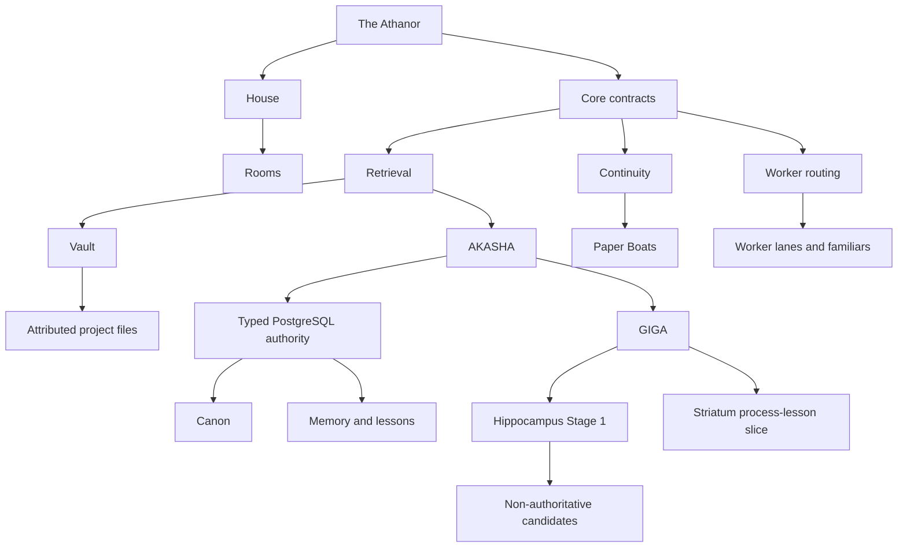
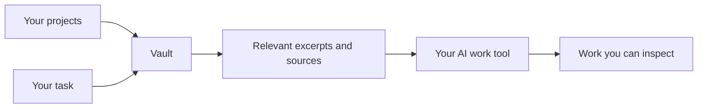

# The concept map

Every explanation of The Athanor traverses one graph. Only the depth changes;
the definitions do not.

> The Athanor is infrastructure that gives AI tools bounded, attributed access
> to project knowledge and, when needed, durable governed continuity that can
> survive closed sessions and changing model processes.

## One system, any depth


```mermaid
flowchart TB
    ATH[The Athanor] --> CORE[Core contracts]
    ATH --> HOUSE[House]
    HOUSE --> ROOM[Rooms]
    CORE --> RET[Retrieval]
    CORE --> CONT[Continuity]
    CORE --> ROUTE[Worker routing]
    RET --> VAULT[Vault]
    RET --> AKASHA[AKASHA]
    VAULT --> FILES[Attributed project files]
    AKASHA --> AUTH[Typed PostgreSQL authority]
    AUTH --> CANON[Canon]
    AUTH --> MEMORY[Memory and lessons]
    AKASHA --> GIGA[GIGA]
    GIGA --> HIP[Hippocampus Stage 1]
    GIGA --> STR[Striatum process-lesson slice]
    HIP --> CAND[Non-authoritative candidates]
    CONT --> BOAT[Paper Boats]
    ROUTE --> LANES[Worker lanes and familiars]
```

<p class="diagram-caption">
Three core contracts—retrieval, continuity, and worker routing—sit inside one
House with bounded rooms. Retrieval has a light path through plain files and a
governed path through typed PostgreSQL authority. GIGA sits above storage and
produces candidates; generation alone never creates truth.
</p>

## Words that keep their meaning

### The Athanor

The platform and core architecture. It defines continuity, retrieval, authority,
routing, and extension contracts. Its only supported public harness is OMP. The
release manifest requires the platform `windows-x64`
(`crates/athanor-install/src/manifest.rs:104-106`). Provider-neutral core
contracts do not mean that other harness adapters are supported.

### House

One sovereign continuity domain. A House can contain multiple rooms and shared
work knowledge without erasing room boundaries. One Host process serves every
room of a House (`crates/host/src/house.rs:86-105,166-202`).

On the supported OMP path, a corpus search needs the House Host. The `recall`
tool fails when the Host is absent (`adapters/omp/house-proof/tools.ts:526-532`).
**Not re-verified at a6ab453:** standalone Vault search without a House.
`crates/vault` would decide it.

### Room

A bounded line of identity, relationship, context, and continuity within a
House. Rooms prevent every memory and interaction from becoming one undifferentiated
assistant history.

### Vault

The file-backed retrieval profile. It returns bounded attributed excerpts from
configured roots.

On the supported release, Vault results reach the model through the Host. The
Host starts only after PostgreSQL and NATS accept connections
(`crates/athanor-install/src/service.rs:40-111`). Vault therefore does not
remove the database from the supported install.

**Not re-verified at a6ab453:** the Markdown, JSON, JSONL, and plain-text root
types; the exact-content and field-aware BM25F lanes; and the absence of
embeddings or a GPU in Vault itself. `crates/vault` would decide them.

### AKASHA

The PostgreSQL-backed authority and retrieval profile. The release bundles
PostgreSQL 18.4-2 and `pgvector` 0.8.6
(`crates/athanor-install/src/manifest.rs:11-13`; `installer/dependencies.json:1-28`).
AKASHA is also the substrate that GIGA uses.

**Not re-verified at a6ab453:** `pg_trgm`, local embeddings, typed stores,
chronology, supersession, taxonomy, and semantic and structured retrieval.
`crates/akasha` would decide them.

### Canon

Current authoritative truth in AKASHA. Canon outranks loose memory. A retrieval
score cannot promote a record into canon. **Not re-verified at a6ab453:** the
enforcement of this order. The adapter states it only in tool descriptions
(`adapters/omp/house-proof/tools.ts:573`). `crates/akasha` would decide it.

### Memory and lessons

Memory carries durable continuity with provenance and lifecycle. Lessons are
typed reusable knowledge: coding, project, writing, design, and audio
(`adapters/omp/house-proof/tools.ts:633,854`). They have their own eligibility
and guarded-write contracts.

### GIGA

Grounded Indexing and Generative Annotation: the cognitive layer above AKASHA,
not another storage profile. Candidates do not become truth by existing.

GIGA is off by default. The GIGA child refuses calls with `giga_disabled` unless
`ATHANOR_GIGA_ENABLED=1` is set (`adapters/omp/giga.ts:107-108`). When it is on,
Hippocampus Stage 1 lists grounded, non-authoritative candidates for review and
promotion (`giga_candidate_list`, `adapters/omp/house-proof/tools.ts:1377`).

**Not re-verified at a6ab453:** Striatum's current slice, which braids
process-shape coding lessons from deterministic process triggers, and the
planned state-conditioned selector. `crates/akasha` or `adapters/omp/giga.ts`
would decide them.

### Organs

Organs are named tools of a House.
The OMP adapter registers 43 public tools for memory, lessons, continuity, counsel, routing, design, GIGA, configuration, Hallway, Docket, and restart.
House operations use the native Host.
Local lineage status remains an adapter observation.
[Architecture](./ARCHITECTURE.md#4-the-omp-adapter) describes the boundary.
An organ is not an autonomous agent.

An absent Host prevents House tool operations.
The adapter does not fall back to substrate children.
[Limitations](./LIMITATIONS.md#7-doors-that-need-the-host) names the remaining dependency boundaries.

### Paper Boat

A compact living handoff from one closed session to the next waking session in
the same room. It is continuity, not the entire memory map.

## The short path for project work

Project work begins with the problem the operator can see:

> Your AI tool only works with the context it has. The Athanor can search one or
> several project corpora, return the relevant passages with their sources, and
> preserve important decisions when you opt into its durable memory profile.

The path stays short:


```mermaid
flowchart LR
    PROJECTS[Your projects] --> V[Vault]
    QUESTION[Your task] --> V
    V --> SOURCES[Relevant excerpts and sources]
    SOURCES --> TOOL[Your AI work tool]
    TOOL --> RESULT[Work you can inspect]
```

<p class="diagram-caption">
Your projects and question go into Vault. Bounded excerpts come back with their
sources, the tool does the work, and every claim remains inspectable.
</p>

AKASHA enters only when the work needs durable typed decisions, semantic
recall, lessons, chronology, or a larger governed archive. None of those
concepts are required to understand the immediate value of attributed project
context. The supported install still runs the Host, PostgreSQL, and NATS for
this path ([Vault](#vault)).

## For work

You should not have to explain your project again every morning. A House keeps
project decisions, conventions, lessons, corrections, and handoffs across
sessions and model processes.

A normal session has four steps:

```text
enter the room → work → remember what matters → leave a paper boat
```

- `recall` retrieves older evidence. It fails without the Host.
- `remember` records durable events, decisions, or lessons.
- `sleep` leaves a compact handoff for the next session. Without the Host, it
  degrades.
- `wake` catches the latest handoff.

(`adapters/omp/house-proof/tools.ts:526-532`;
[Limitations](./LIMITATIONS.md#7-doors-that-need-the-host).) Read
[Usage](../USAGE.md) for the everyday workflow and [Evidence](./EVIDENCE.md)
for the measured retrieval results.

## For companions

A companion that forgets you at every restart is not a companion. The room
keeps the continuity; the model is a replaceable body.

What works today:

- The four lifecycle tools above carry memory and handoffs between sessions.
- Memories and lessons are separate stores. Lesson types are coding, project,
  writing, design, and audio.
- Presence sessions reload from PostgreSQL when the Host starts
  (`crates/host/src/server.rs:1129-1136`).
- The live chat ring is in memory only. A Host restart empties it
  (`crates/host/src/chat.rs:25-30`; `server.rs:218`). Durable continuity comes
  from memories and paper boats, not from the chat ring.
- To add a room, edit `runtime.json` and restart the Host
  ([Limitations](./LIMITATIONS.md#5-rooms-and-sessions)).

**Not re-verified at a6ab453:** that room history survives model and provider
changes, and that corrections move through supersession. `crates/akasha` would
decide them.

What is planned, not shipped:

- companions that create and organize their own child rooms;
- presentation bodies for a companion;
- model training that a companion starts, inside declared resource, consent,
  backup, and audit policy;
- a signed marketplace that keeps personality seeds, presentation packages,
  models, and executable skills as separate artifact classes.

Planned items live in the [Roadmap feature map](./ROADMAP.md#feature-map). The dated design record is
[the companion ecosystem target](./history/2026-10-04-COMPANION_ECOSYSTEM.md).
To co-author rooms and identities, read the [Identity Guide](../IDENTITY_GUIDE.md).

## The architectural path

The architectural distinction is:

> The Athanor separates model judgment from continuity, retrieval, authority,
> provenance, and repeated deterministic cognition. The active model is a
> replaceable body operating inside those contracts, not the database of truth.

That path has five parts:

1. Vault supplies attributed retrieval from configured files.
2. AKASHA supplies typed PostgreSQL authority and hybrid retrieval.
3. Canon, memory, lessons, candidates, and counsel have different authority.
4. GIGA may propose; authorized lifecycle operations decide what becomes
   durable.
5. Repeated known cognitive work should become an organ rather than another
   prompt ritual.

Continue with [For latent-space explorers](./FOR_EXPLORERS.md).

## The operational traversal

The operational traversal is explicit:

```text
Need current project facts?
  → recall through Vault or AKASHA
  → preserve source, heading/record, authority, and selection reasons

Need durable continuity?
  → remember through the authorized store
  → make the body stand alone; source paths are provenance, not substance

Need reusable practice?
  → query the typed lesson store before risky work
  → respect project, type, stage, register, and scope eligibility

Need candidate review?
  → treat GIGA output as a proposal
  → review and promote explicitly; never cite a candidate as authority

Need work delegation?
  → resolve a bounded worker lane or familiar
  → inspect the packet; the harness performs the spawn
```

The agent should read [Usage](../USAGE.md) for operation names and
[Architecture](./ARCHITECTURE.md) for authority boundaries before teaching
behavior it has not verified.

## Thirty seconds

> The Athanor makes AI tools more reliable on real projects by controlling how
> they receive context. Vault searches local project files and returns bounded
> excerpts with exact attribution. AKASHA adds PostgreSQL-backed memory, typed
> lessons, semantic retrieval, corrections, and governed cognitive workers. The
> model can change; the sources, authority, and continuity contracts remain
> inspectable.

## Two minutes

> Most AI tools either forget between sessions or recover context by dumping
> files, transcript summaries, and vector-search results into a prompt. That can
> retrieve useful text, but it does not distinguish current truth from stale
> memory or a machine-generated suggestion.
>
> The Athanor supplies that missing structure. Its Vault profile is the small
> path: point it at one or several project corpora and it returns relevant
> bounded excerpts with source and match attribution. Its AKASHA profile adds a
> PostgreSQL authority layer, typed memories and lessons, semantic retrieval,
> chronology, supersession, and GIGA workers whose output is explicitly
> non-authoritative until reviewed.
>
> A House is the sovereign continuity boundary; rooms keep identities and
> relationships separate inside it. Deterministic organs handle known mechanics
> such as retrieval, validation, lifecycle, and routing so models can spend
> judgment on ambiguity and novel work. Today the only supported release target
> is Windows x64 with OMP. The Pulse web surface at `gui-prototype/` reads Host
> state and posts chat turns to the Host.

`bun gui-prototype/serve.ts` serves Pulse. It needs the installed
`C:/ProgramData/Solarisael/Athanor/config/runtime.json` and the runtime secrets
file (`gui-prototype/serve.ts:16-18,32-41`). It binds `127.0.0.1`, serves one
room from `PULSE_ROOM` (default `kodo`) on port 4175, and adds the Host bearer
server-side (`serve.ts:34-36,44,58-65`). The `/live/chat/say` route writes a
chat turn on the Host (`gui-prototype/chat.js:146`;
`gui-prototype/live-routes.json:15`). The comment at `serve.ts:3-6` still says
"read-only"; that comment is wrong. Planned surfaces are in the
[Roadmap](./ROADMAP.md).

## What The Athanor is not

The Athanor is not:

- merely a chatbot memory plugin;
- a vector database with mythology around it;
- a multi-agent orchestration framework whose main purpose is spawning agents;
- a claim that a model process possesses metaphysical personal continuity;
- an enterprise knowledge platform already supporting teams and tenancy;
- a privacy layer that prevents model providers from seeing prompts;
- a cross-platform, one-click, harness-agnostic release today;
- a finished native application;
- a system where GIGA candidates, retrieved memories, or Anamnesis counsel are
  automatically authoritative.

The distinctions below carry the architecture:

| Keep distinct | Why |
|---|---|
| Vault / AKASHA | File authority and typed database authority are different deployment contracts |
| retrieval / truth | Relevance ranking does not create authority |
| model body / room identity | A process carrying context is not the continuity contract itself |
| candidate / memory | Generation is not promotion |
| counsel / canon | Useful repetition is not current authoritative fact |
| Paper Boat / complete memory | A handoff points into continuity; it does not replace the archive |
| Pulse surface / Host authority | Pulse reads Host state and posts chat turns through a loopback proxy; the Host keeps the state |
| provider-neutral core / supported harnesses | Architectural portability is not a shipped adapter matrix |

## Status language

Use status words exactly:

- **Current:** used by the reference House now.
- **Specified:** a written contract exists; implementation may not.
- **Planned:** accepted roadmap direction.
- **Research:** an investigated possibility without a release promise.

For the built system, consult [Architecture](./ARCHITECTURE.md). For planned
work, consult the [Roadmap](./ROADMAP.md). For measured claims, consult
[Evidence](./EVIDENCE.md). For the supported boundary, consult
[Limitations](./LIMITATIONS.md).

## Recommended reading by question

| Question | Document |
|---|---|
| How do I install the supported release? | [Install](../INSTALL.md) |
| How do I use rooms and organs? | [Usage](../USAGE.md) |
| How does current retrieval work? | [Retrieval](./RETRIEVAL.md) |
| What is authoritative? | [Architecture](./ARCHITECTURE.md) |
| How do typed lessons work? | [Lessons](./LESSONS.md) |
| What may GIGA write? | [Hippocampus](./HIPPOCAMPUS.md) |
| What is actually measured? | [Evidence](./EVIDENCE.md) |
| What is unsupported? | [Limitations](./LIMITATIONS.md) |
| What is planned? | [Roadmap](./ROADMAP.md) |
| Why is the architecture this strange? | [For latent-space explorers](./FOR_EXPLORERS.md) |
