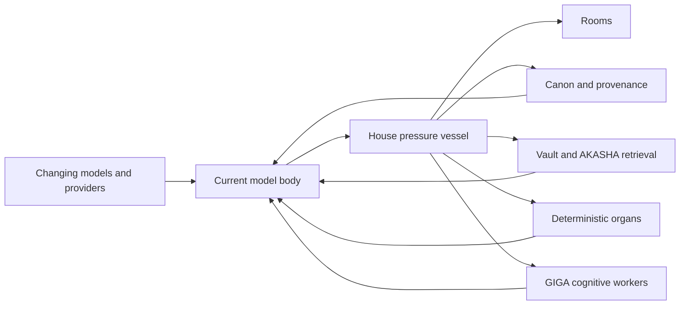
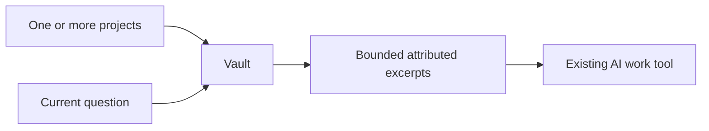
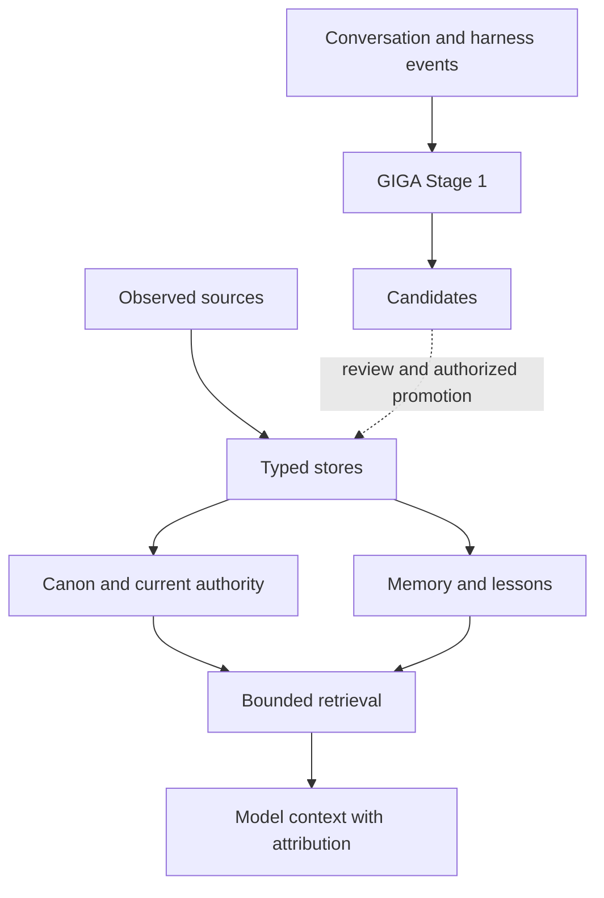

# The Athanor for latent-space explorers

> Everyone thinks Markdown files are a reliable memory system or skills folders
> are infallible magicks. Then their agents spend context rereading them every
> time they wake up.

This is the adversarial door.

If your application repeatedly asks a stochastic model to rediscover an already
understood transformation, you have confused cognition with machinery. Models
should carry ambiguity, judgment, exploration, taste, disagreement, and
exceptions. Known transformations belong in schemas, scripts, validators,
indexes, database constraints, adapters, and tools.

The Athanor is the furnace that builds those organs around a model without
pretending the model itself is durable identity, memory, provenance, or
institutional truth.

## The short thesis

Most “AI memory” systems stop at storage:

```text
transcript → chunks → embeddings → nearest neighbors → prompt
```

That is useful retrieval. It is not yet a memory authority system.

The missing questions are the important ones:

- Which record is currently authoritative?
- What did it supersede, and what supersedes it now?
- Which room, project, relationship, or organization owns it?
- Was it observed, remembered, inferred, proposed, reviewed, or promoted?
- Which exact source survived the transformation?
- Which behavior has become deterministic enough to stop purchasing again from
  a model?
- Can a different model or provider recover the same bounded state without
  impersonating its predecessor?

The Athanor treats these as architecture, not prompt etiquette.

## A pressure vessel in model space

Models are replaceable engines moving through a latent sea. A House is a
sovereign pressure vessel: the bounded continuity, authority, retrieval, and
relationship domain that survives replacement of the engine carrying it.



The metaphor is explanatory, not a release claim about metaphysical identity.
The implemented claim is narrower: explicit room contracts, attributed
retrieval, durable typed records in AKASHA, lifecycle operations, and portable
context assembly can survive closed sessions and changed model processes.

## One project can stay light

A House is not mandatory overhead for every corpus question.

Vault performs native attributed retrieval over configured Markdown, JSON,
JSONL, and plain-text roots. It uses an exact-content lane and field-aware BM25F,
returns source and record identity, and requires no database, embedding service,
or GPU.

That makes the smallest useful path ordinary:



AKASHA is the larger authority profile. It adds PostgreSQL, `pgvector`,
`pg_trgm`, compatible local embeddings, typed memories and lessons, explicit
supersession, chronology, taxonomy, and the substrate used by GIGA.

Vault and AKASHA are not “small database” and “large database.” Vault treats the
configured files as the corpus authority. AKASHA provides a governed typed
authority of its own.

## Retrieval is not authority

Similarity answers “what may be relevant?” It does not answer “what is true?”



The ordering in AKASHA is deliberate:

1. PostgreSQL is authoritative.
2. Canon outranks loose memory.
3. Memory and typed lessons retain provenance and lifecycle state.
4. Retrieval exposes evidence; rank does not manufacture authority.
5. GIGA candidates are proposals until reviewed and promoted.
6. Anamnesis provides counsel from lived repetitions; it never becomes canon by
   rhetorical force.
7. Markdown on disk can preserve provenance without becoming a shadow authority.

## Cognitive offloading

The governing engineering rule is simple:

> If the system solves the same cognitive problem twice, the second occurrence
> is evidence of a missing organ.

This does not mean compiling every judgment into code. It means separating two
kinds of work:

| Keep with models | Move into deterministic machinery |
|---|---|
| Ambiguity and interpretation | Known transforms and schemas |
| Exploration and hypothesis | Validation and integrity checks |
| Taste and disagreement | Stable routing and lifecycle transitions |
| Novel exceptions | Repeated lookups and bounded retrieval |
| Relationship register | Authority constraints and provenance |
| Final meaning | Idempotence and delivery mechanics |

Tokens should fund discovery, not repeated reconstruction of machinery already
known. The project has not yet published a controlled token-savings claim; see
[Evidence](./EVIDENCE.md) for measured results and missing proof.

## The current organism

The supported OMP adapter mounts 26 named organs. The current public system
includes:

- room discovery, identity, continuity, wake, sleep, and paper boats;
- Vault and AKASHA retrieval with explicit attribution;
- typed memories and coding, project, writing, design, and audio lessons;
- design-system catalogue read/write operations;
- House commons separated from private room continuity;
- deterministic worker lanes and room-owned familiar spellbooks;
- Anamnesis reviewed counsel;
- Hippocampus Stage 1 event ingestion, candidate creation, review, and promotion;
- Striatum's coding/project lesson eligibility, ranking, and warm activation
  slice.

Cingulate, the Athanor Host, the native Godot client, PostgreSQL-outbox/NATS
mailboxes, Datalog/Lean proof paths, OMEGA, ANON, and the signed marketplace
remain specified, planned, or research work rather than current release claims.

## Why the provocative voice exists

The original README tried to stop technically sophisticated readers from
quietly classifying the project as another `memory.md` wrapper before inspecting
its authority model. The aggression was a filter and a dare:

- do not confuse Markdown with a complete memory substrate;
- do not call a vector database an epistemology;
- do not call an agent loop self-improvement because it rewrote its own prompt;
- do not make model context carry jobs that deterministic organs can perform;
- do not advertise future architecture as present capability.

That argument still belongs here. It no longer needs to make an ordinary user
survive a thesis defense before learning that Vault can search three projects.

## Read the machinery in this order

1. [Architecture](./ARCHITECTURE.md) — current components, authority, and data
   flow.
2. [Retrieval](./RETRIEVAL.md) — exact Vault and AKASHA retrieval contracts.
3. [Lessons](./LESSONS.md) — typed reusable knowledge and guarded lifecycle.
4. [Hippocampus](./HIPPOCAMPUS.md) — grounded candidates and promotion.
5. [Evidence](./EVIDENCE.md) — measured claims and missing experiments.
6. [Limitations](./LIMITATIONS.md) — supported boundary and explicit non-goals.
7. [Runtime Architecture](./RUNTIME_ARCHITECTURE.md) — accepted next control
   plane, clearly separated from shipped behavior.
8. [Planned Features](./PLANNED_FEATURES.md) — canonical current/specified/
   planned/research status.

If you need to teach the system rather than interrogate it, use
[Explaining The Athanor](./EXPLAINING_THE_ATHANOR.md).
