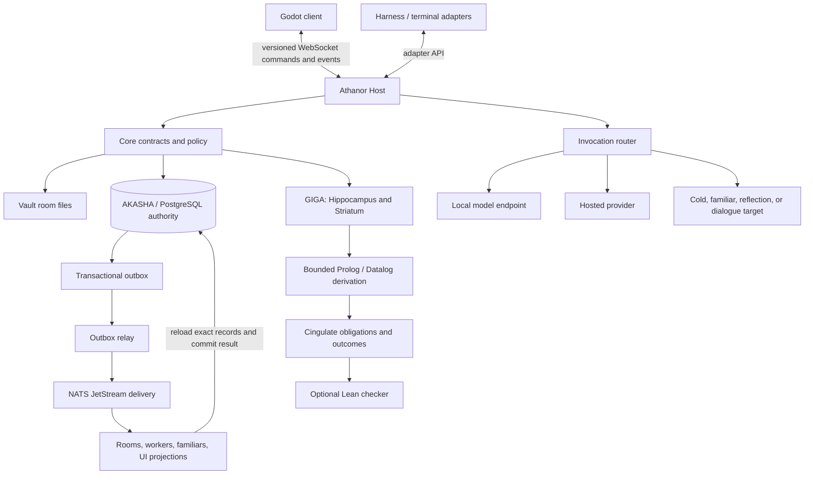
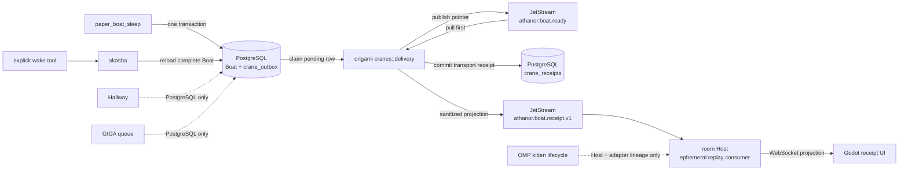
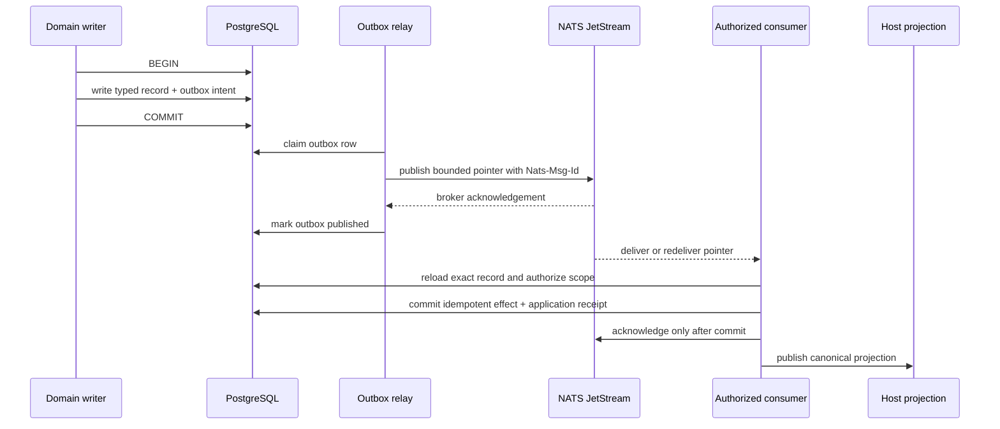
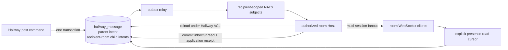

# Runtime Evolution Architecture

Status: 1.0 runtime spine implemented in the 0.9.6 late beta; operator product and release gates remain
Last updated: 2026-08-17

This document defines the implemented Host, Godot, Recall Policy, Paper Boat,
and narrow delivery spine together with accepted longer-range contracts for
dynamic model/room embodiment, explainable rule derivation, Cingulate proof
routing, selected Lean obligations, governed synthesis, and companion-facing
execution.

The implementation order is normative because later layers depend on evidence
and contracts created by earlier layers. The public release order lives in
[`roadmap.md`](./roadmap.md).

## 1. Current boundary

The current `0.9.6` source has:

- one Rust domain/protocol workspace;
- file-authoritative Vault and PostgreSQL-authoritative AKASHA;
- GIGA Hippocampus Stage 1 and the Striatum coding/project slice;
- authenticated Host WebSocket snapshots, typed deltas, resync, persistence,
  idempotency, and restart recovery;
- PostgreSQL-authoritative Hallway channels with explicit allowed rooms,
  multi-session presence, daily threads, ordered recipient-sensitive posts,
  room-stable unread state, durable Bell notifications, and recipient-authorized
  bounded Knocks; OMP tools expose exact-thread reads while Host owns automatic
  revision-gated inbox projection and claims pointer-only wake requests;
- Host-owned Recall Policy shared by OMP and Godot;
- transaction-coupled Paper Boat sleep/wake and `boat.ready` Crane outbox rows;
- a Crane delivery substrate with one
  `crane_outbox`/`crane_receipts`/`crane_dead_letters` trio, lane-routed
  subjects, strict pointer envelopes, consumer backoff, expiry refusal, and
  dead-letter handling; `boat.ready` is the only current production outbox
  producer, while addressed Crane production and recipient application handlers
  remain structural/test-only;
- bounded NATS JetStream pointer delivery and sanitized transport-receipt replay;
- functional Godot Recall Policy and Paper Boat receipt screens;
- native Windows lifecycle and installer.

The following surfaces described later remain specified or planned, not current:

- invocation-time model selection;
- headless room reflection and live room dialogue targets;
- Prolog/Datalog derivation and complete Cingulate outcome enforcement;
- Lean-backed obligations, e-graph/egglog normalization, Z3, SyGuS, and
  Wasmtime capability sandboxing;
- proof-guided repair or offline training-data production;
- companion-authored models and marketplace artifacts;
- the in-world Godot renderer and GPU-particle constellation;
- Origami folds, Pawprints, lifecycle states, and room wake behavior on the Crane
  lanes beyond `boat.ready` pointer delivery and its receipt ledger.

The current GIGA queue and all durable receipts remain PostgreSQL-owned. NATS is
delivery-only; Godot is presentation-only. Neither may be described as memory or
authority.

## 2. Load-bearing invariants

Every implementation must preserve these rules:

1. PostgreSQL is authoritative for AKASHA records, authority state, exact source
   references, review state, outcomes, and durable delivery records.
2. A transport owns delivery progress, never truth.
3. A model body is replaceable compute, never an identity.
4. A room or spirit grants authority through an explicit authenticated binding,
   never through a working directory, process name, model name, or prompt claim.
5. Generated candidates remain proposals until the relevant review or promotion
   contract grants authority.
6. Model inference starts from explicit evidence. Hidden token history from a
   previous job never becomes an undeclared source.
7. User interfaces consume canonical commands and events. They do not bypass the
   Host to mutate PostgreSQL, NATS, model endpoints, or harness state directly.
8. Cross-room access is explicit, scoped, attributable, and denied by default.
9. Every hard gate names its authoritative obligation and the proof it requires.
10. Failure in optional cognition or transport must not silently rewrite truth or
    block an otherwise healthy local conversation.

## 3. Target topology



This is one control plane with several replaceable execution surfaces. The Host
is not a new memory authority. JetStream is not a second ledger. Godot is not a
second harness. A room session is not a model process.

## 4. Host-facing contracts

The Athanor Host is the stable boundary between interactive clients and the
runtime. Godot speaks only to the Host over a versioned WebSocket protocol.
Harness adapters may use the same logical commands and events through their own
native integration.

The Host owns:

- authentication of operator, House, room, and spirit bindings;
- command validation and idempotency checks;
- request correlation and event sequencing;
- projection of health, review, retrieval, and delivery state;
- invocation routing through adapter/provider contracts;
- audit-safe error responses;
- capability negotiation by protocol version.

The Host does not own:

- memory authority;
- model-provider truth;
- raw database editing from UI payloads;
- direct transport-specific business rules;
- identity inferred from the client window or current directory.

### 4.1 Command and event envelope

Every command and durable event uses stable identifiers and an explicit schema
version. The logical envelope contains:

```text
schema_version
message_id or event_id
house_id
sender_room
sender_spirit
sender_session
recipient
command_or_event_type
correlation_id
causation_id
reply_target
idempotency_key
source_record_refs
scope
visibility
authority_class
created_at
expires_at
max_hops
```

A command asks one authorized handler to attempt a state transition. An event
states that an authoritative transition already occurred. Consumers must not
reinterpret an event as permission to perform a broader command.

Mutation commands require an idempotency key. Replaying the same command must
return the existing result or a stable conflict, not create a second write.

### 4.1.1 Origami handoff vocabulary

The accepted handoff vocabulary maps directly to versioned contracts:

- **Origami** folds authoritative state into one recipient-specific capsule and
  unfolds it through deterministic runtime tooling;
- a **crease pattern** is the versioned schema and reconstruction contract;
- a **Crane** is an active message or bounded handoff addressed to a current
  worker, familiar, room, reviewer, or other authorized consumer;
- a **Paper Boat** is a living continuity message addressed to the same room
  across sleep;
- a **Pawprint** is room-scoped provenance and integrity, never memory,
  authority, identity proof by itself, or a covert model instruction.

Origami extends the command/event envelope with bounded fields such as:

```text
crease_pattern
handoff_kind
payload_ref
payload_digest
source_context_digest
lifecycle_state
pawprint
```

Adapters fold and unfold stable contracts, exact source references, budgets,
authorization, expiry, idempotency, and recipient context mechanically. Models
receive ordinary legible context and judge only the remaining ambiguity. They do
not decode hidden instructions or reconstruct contract fields from style.

A Crane lifecycle is explicit and monotonic:

```text
folded -> outboxed -> in_flight -> landed -> unfolded -> returned
                                      \-> torn
```

Redelivery may revisit transport states but cannot apply the represented
operation twice. A related concurrent set of Cranes may be exposed as a
**flight** only when it shares one durable parent intent and explicit child
correlation IDs.


### 4.2 Model selector

Model choice is one invocation axis. The logical `ModelSelector` includes:

```text
route: local | provider | auto
provider_id
model_id
required_capabilities
privacy_class
maximum_cost
maximum_latency
minimum_context_window
residency_preference
fallback_policy
```

`auto` selects only from operator-approved endpoints that satisfy the declared
capabilities and privacy class. Selection reasons must be visible. A model
fallback cannot widen data custody or authority.

### 4.3 Execution target

The execution target is independent from the model selector:

```text
cold_worker
familiar
room_reflection
room_dialogue
```

- `cold_worker` receives a bounded packet and returns findings or candidates. It
  carries no room identity or promotion authority.
- `familiar` uses a room-owned familiar definition bound to a deterministic
  worker lane. It remains bounded by that lane and its declared authority.
- `room_reflection` starts a disposable branch from an explicit room/spirit
  binding and durable continuity. It does not silently inherit the live chat
  tail or join an interactive transport.
- `room_dialogue` addresses an intentional live room session and may receive its
  current dialogue context under room policy. This mode must be visibly distinct
  from background reflection.

A target label alone does not grant authority. The runtime verifies the room,
spirit, caller, policy, and allowed operations for every invocation.

### 4.4 Session lifecycle

Session lifecycle is another independent axis:

```text
start: ephemeral | reuse | wake
finish: release | keep_warm | pin
```

- `ephemeral` creates a disposable session from explicit durable inputs.
- `reuse` addresses an already active compatible session.
- `wake` restores a dormant named session from durable continuity.
- `release` unloads the session after completion.
- `keep_warm` retains it for a bounded idle period.
- `pin` requires explicit policy and remains observable until released.

Model residency is not session continuity. Keeping weights loaded can reduce
latency, but it does not authorize reuse of hidden conversational or KV state.

### 4.5 Versioned delta synchronization

Interactive clients synchronize versioned projections, not whole backend
objects after every mutation.

The Host sends one initial snapshot when a client subscribes or resynchronizes:

```text
projection_id
schema_version
snapshot_id
version
sequence
state_hash
state
```

After that snapshot, the Host sends only typed deltas:

```text
delta_id
projection_id
base_version
next_version
sequence
source_event_ids
mutations
coalesce_key
created_at
```

Mutation types are domain operations such as field update, item insert, item
remove, item move, status transition, and bounded list append. Prefer typed
operations over arbitrary string-path patches so schema validation and
authorization remain explicit.

The client applies a delta only when `base_version` equals its current
projection version and the sequence is next. On a gap, duplicate conflict,
unknown mutation, or hash mismatch, it requests replay from the last
acknowledged sequence. If the bounded replay window no longer contains that
sequence, the Host sends a fresh snapshot.

The client acknowledges the applied projection version. The Host may coalesce
superseded updates to the same field or disposable telemetry, but it cannot
coalesce away an authoritative status transition, audit event, or user-visible
intermediate state required by the contract.

Snapshots are recovery and initial-load mechanisms, not the ordinary broadcast
path. A tiny mutation must not trigger serialization, transmission, parsing,
scene reconstruction, or redraw of the complete projection.

## 5. Thin Godot control surface

The current UI slice exposes real Recall Policy, Paper Boat delivery state, and
worker-lane status through one root-owned authenticated Host session while the
runtime evolves. It is not the final avatar, animation, voice, or marketplace
surface.

The product anatomy is fixed before chat transport lands: room/session
navigation on the left, active conversation in the center, contextual
inspection on the right. Auxiliary Host-backed tools replace or overlay the
center explicitly. Wide, compact, and narrow layouts preserve center priority;
one center scroller owns page movement. Placeholder sidebars and chat surfaces
state that their Host projections are absent instead of synthesizing them.

The first usable client must expose:

- Houses, rooms, governing spirits, and active sessions;
- chat through the Host command/event contract;
- recall results with exact sources and authority state;
- Vault, AKASHA, GIGA, model, queue, and delivery health;
- Hippocampus candidate and Curio review;
- Striatum's active lesson set and activation reasons;
- a Cingulate obligation/conflict placeholder that can later render real proof
  state without changing the UI contract;
- an event and delivery inspector with correlation, causation, retry, and
  dead-letter state;
- a terminal escape hatch for unsupported operations.

The client must never:

- connect directly to PostgreSQL;
- publish directly to NATS;
- call Ollama or hosted providers directly;
- discover identity from a folder path;
- create a second persistent conversation beside the harness;
- hide whether an action is current, pending, failed, or merely proposed.

The UI should deepen after every backend phase. Finishing an ornamental client
before the underlying contracts stabilize would freeze the wrong architecture.

The Godot client maps each projection to a bounded view-model or scene subtree.
One `AthanorHostSession` owns credentials and the WebSocket for the Control
tree. Screens consume its typed events and keep projection-specific state; a
new screen must not open a second socket merely because it needs another Host
projection.
Applied deltas emit signals only for affected nodes. Static panels do not poll
through `_process()`. Custom drawing calls `queue_redraw()` only for the changed
`CanvasItem`, and compatible mutations may be batched once at the next frame
boundary. Protocol-level deltas reduce invalidation pressure; the client still
measures renderer behavior rather than claiming that a delta guarantees zero
GPU work.

The functional Control tree is built first and may then be rendered through a
SubViewport inside the 3D room with camera-driven focus transitions. The same
tree remains available as a focused fullscreen surface. The canonical high-tier
constellation uses a GPU-particle field for stable nodes, edges, and motion;
fine-grained Host deltas update stable GPU records rather than scene nodes.

The full visual, renderer, performance-tier, and companion-body contract lives
in [`GODOT_CLIENT.md`](./GODOT_CLIENT.md).

## 6. GIGA integrity before distribution

GIGA must become a clean producer of evidence-bound refinement candidates before
its jobs are distributed across models or rooms.

### 6.1 Three contexts that must remain separate

The runtime distinguishes:

1. **Evidence context** — exact durable turns, task events, authority records,
   reviewed precedents, and source hashes selected for one job.
2. **Inference context** — the tokens sent to one model invocation.
3. **Model residency** — loaded weights and process resources retained for
   latency.

Fresh inference does not require discarding durable evidence. Conversely,
keeping a model resident must not retain undeclared conversational history.

Every cold GIGA job is a fresh inference over an explicit bounded evidence
snapshot. Gate and extraction passes may be separate fresh invocations. Neither
may depend on the previous job's hidden response, KV cache, or session handle.

### 6.2 Completed-turn anchors and overlapping evidence

The current source observer batches bounded conversation windows. The next
integrity slice should anchor durable events to completed interaction boundaries
and build deterministic overlapping windows from the trusted ledger.

Overlap is deliberate: a durable fact can span adjacent user and assistant
turns. Duplicate appearances are reconciled by stable source IDs and hashes,
never fuzzy paraphrase alone.

Each job records:

- the exact ordered source IDs;
- source hashes and byte/turn bounds;
- the evidence-builder version;
- the authority and room filters applied;
- reviewed precedents and active lessons selected;
- the prompt and model configuration digest.

Residual buffered evidence is flushed on a clean shutdown, but shutdown is not
the normal semantic boundary for a completed interaction.

### 6.3 Evidence hydration

A worker receives durable event IDs, not copied private prose in a queue payload.
Before inference, the trusted worker reloads and verifies:

- exact source records;
- room, session, role, order, and content hashes;
- current authority neighbors for referenced records;
- reviewed precedents relevant to the same candidate kind;
- applicable authoritative lesson metadata;
- bounded project and thread context when explicitly supported by the event.

Hydration failures produce an inspectable failed job. They do not trigger a
best-effort candidate from incomplete or mismatched evidence.

### 6.4 Refinement transaction

GIGA may propose a general refinement transaction alongside ordinary memory and
lesson candidates. The logical contract contains:

```text
artifact_kind
operation: create | update | supersede | retire | rollback
target_id
baseline_version
scope
trigger_refs
evidence_refs
expected_outcome
proof_requirement
review_state
observed_outcome
proof_receipt
```

`expected_outcome` records the predicted effect before execution.
`observed_outcome` records what actually happened afterward. One must never be
copied into the other as if prediction were observation.

A stale `baseline_version` rejects or rebases the proposal explicitly. The
reviewed transaction authorizes only the named operation against the named
baseline. GIGA proposes; the relevant authority reviews; Cingulate observes the
result and closes the proof receipt.

### 6.5 Dismissal and recurrence

Dismissal is review evidence, not deletion. A dismissed candidate retains its
kind, source fingerprint, baseline, dismissal reason, reviewer, and policy
version outside ordinary retrieval.

When later evidence resembles a dismissed candidate, GIGA records a recurrence
against that history instead of silently recreating the same proposal as new.
Policy decides whether stronger evidence, a changed baseline, or repeated
recurrence returns it to review. A Curio remains a deliberate separate state;
recurrence alone cannot promote either a dismissal or a Curio.

### 6.6 Selective becoming and native behavior guards

Continuity uses governed selection, not maximum retention. The runtime preserves provenance while authority and active influence change.

Review surfaces and receipts distinguish:

- **never mine** — considered but refused as part of the lineage;
- **once true** — formerly authoritative, now historical;
- **not here** — valid only outside the current room, project, or register;
- **not now** — dormant outside the current task or lifecycle state;
- **superseded** — replaced by a named newer authority.

Striatum derives an inspectable state vector from trusted context. Eligibility is a hard boundary before ranking. An empty eligible set is valid.

Athanor lessons remain typed authorities in PostgreSQL. Their trigger fields are dormant until review adds the `ttsr-approved` tag.

The adapter captures the active native OMP `TtsrManager` through a guarded compatibility seam. It registers versioned approved lessons as native rules.

OMP owns stream matching, interruption, retry, and reminders. The adapter filters superseded Athanor rule versions before they can match.

The seam checks every required OMP method. It fails open with a visible warning when an OMP update changes the compatible surface.

Native synchronization uses OMP’s once-per-session repeat policy. Athanor keeps second-based cooldown metadata, but the bridge does not emulate it.

Resident local-model prompts are worker contracts. The reference House writes
them in the A Squall quest register: bracketed system frame, precise role and
target, voiced objectives, animated responsibilities that encode real
invariants, exact nouns, and explicit refusal. JSON schemas and validators
remain the machine boundary. Resident classifier constitutions may exceed the
350-word dispatch-quest ceiling when their stable taxonomy requires it, but
they remain concept-minimal and are evaluated against the prior prompt on the
same blinded corpus.

## 7. House communication spine: PostgreSQL, Crane, NATS, and Host

This section separates the current source from accepted expansion. The current
lane is narrower than the target: NATS proves bounded Paper Boat pointer
transport and receipt projection. It does not yet deliver Hallway posts, project
records, kitten work, GIGA jobs, or live conversation turns.

### 7.1 Current NATS source census

Only `delivery` and `host` depend on `async-nats`. `akasha`, GIGA, Hallway, the
OMP adapter, kitten lineage, and the Godot Rust client do not connect to NATS.

The native service starts one loopback JetStream server with file storage, then
delivery. Independent `athanor.exe` starts one in-process multi-room Host and
gives it the same NATS URL; it does not launch Godot or own OMP process lifetime.
The managed server has no NATS accounts, users, credentials, or subject ACLs.
Loopback binding is its containment boundary.

The compiled JetStream contract is:

| Stream | Subject or filter | Consumer | Current producer and effect |
|---|---|---|---|
| `ATHANOR_BOAT_READY` | `athanor.boat.ready` | durable pull consumer `athanor-boat-ready-receipts-v1` | `paper_boat_sleep` is the only production outbox producer; delivery validates the pointer and records a transport receipt |
| `ATHANOR_CRANE` | `athanor.crane.>`; addressed form `athanor.crane.<recipient_kind>.<recipient_key>` | one durable pull consumer `athanor-crane-receipts-v1` | addressed inserts exist in tests; the generic consumer records receipt validation but does not deliver to or invoke the named recipient |
| `ATHANOR_BOAT_RECEIPTS` | `athanor.boat.receipt.v1` | up to 64 ephemeral Host consumers with `DeliverPolicy::All` | delivery publishes sanitized Paper Boat receipt projections; Hosts replay, filter, and broadcast accepted state over WebSocket |

All three streams use `LimitsPolicy`, file storage, `DiscardOld`, one replica,
seven-day retention, 100,000 messages, 512 MiB, 4 KiB maximum messages, and a
24-hour duplicate window. The lane streams permit one consumer; the receipt
stream permits 64. Delete and purge are denied.

Lane consumers use explicit acknowledgements, a 30-second `AckWait`,
`MaxDeliver = 5`, 64 maximum pending acknowledgements, batches of 64, and
30/60/120/300/600-second backoff. The PostgreSQL publisher lease is 30 seconds;
its ten-attempt retry schedule is 1/5/15/30/60/120/300/600 seconds. Every
publish sets `Nats-Msg-Id` to the immutable outbox event UUID. Existing
stream/consumer policy drift is refused rather than silently rewritten.



The ready file is currently written after database schema verification and a
NATS connection, before the run loop lazily creates or verifies streams and
consumers. That is connection readiness, not complete delivery readiness.

The current `CraneEvent` v1 is memory-shaped: `record_id` is a positive decimal
memory ID, and outbox/receipt `aggregate_id` columns reference memories. The
strict envelope carries schema version, event ID and kind, memory record ID,
room, creation time, integrity digest, and optional crease, typed recipient,
expiry, parent intent, and correlation fields. Private body-shaped keys are
refused.

A current addressed Crane receipt proves that the generic delivery consumer
validated a memory pointer after NATS delivery. It does **not** prove that the
worker, familiar, room, or reviewer received, unfolded, accepted, or applied the
record. Likewise, the present Paper Boat `Delivered` projection means transport
receipt validation, not room wake, model consumption, or human reading.

Hallway posts remain ordered PostgreSQL transactions. Session delivery cursors,
room-stable unread sequence, daily threads, targeted Bell rows, room-local Knock
policy history, and bounded Knock lifecycle rows are distinct state. Manual OMP
tools call the substrate for Hallway operations; the authenticated Host queries
the inbox and owns per-session Bell revision gating. Ordinary posts never wake a
room. An explicit permitted Knock is claimed through the recipient's Hallway
presence under a short Host lease whether that session is idle or active. Once
OMP accepts the trusted pointer-only injection, the adapter settles the Knock
as started before the model can answer; an active turn is aborted only after
that authoritative settlement succeeds. The custom message's own
`message_start` identifies the bounded turn when OMP preserves its metadata.
When OMP omits that hook, the doorman uses `agent_end`: an idle delivery owns
the first end, while an active interruption consumes the aborted predecessor's
end and assigns the following end to the Knock. A delivered wake with no
observable lifecycle end fails locally after 60 seconds; started/completed
settlement retries stop and release the local doorman after 25 seconds. A
claimed or started row beyond the root expiry becomes an explicit failure on
the next room claim.
Knock Host requests have a 10-second deadline. Failed claims retry with
exponential 5–60 second backoff so one slow Host cannot create a poll storm.
Trusted Bell and Knock notices
contain counts or pointer identities only, never peer prose; claiming a Knock
does not clear the Bell.
GIGA remains a PostgreSQL queue whose worker calls Ollama. Kitten lifecycle
events remain local OMP events
normalized through Host and written by the adapter. Project support is currently
project-scoped lessons, GIGA keys, and retrieval—not a project event stream or
NATS lane. Live conversation remains in the harness and Host conversation log;
Host still has no general conversation-send command.

### 7.2 Stable roles

The communication spine keeps one job per component:

| Component or concept | Stable responsibility |
|---|---|
| PostgreSQL | authoritative domain records, order, permissions, idempotency, outbox state, application receipts, and user-visible cursors |
| NATS JetStream | bounded pointer transport, redelivery, wake signals, and replayable projections; never record authority |
| Athanor Host | authenticate commands, authorize subscriptions and reloads, apply crease handlers, and project canonical state to clients |
| WebSocket | immediate local commands, streaming response deltas, and multi-session UI fanout |
| Project | authority and visibility scope, not a mailbox |
| Hallway | durable social log with explicit membership; ordinary contact is manual, while a separate recipient-authorized Knock may start one bounded turn |
| Kitten or worker | bounded actor operating under a work and capability contract |
| Crane | delivery intent for one typed authoritative record, not the record itself |

One communication spine does not mean one generic message table. Hallway
messages, project records, work items and results, conversation turns, Paper
Boats, and GIGA events retain distinct authoritative schemas and lifecycle
rules.

### 7.3 Authority reference, Crane projection, and application receipt

The next Crane schema must replace the v1 memory assumption with a typed
authority reference:

```text
record_kind
record_id
record_version
integrity_sha256
```

The generic envelope adds only transport and causality:

```text
schema_version
event_id
event_kind
house_id
sender identity
typed recipient
project and room scope
created_at
expires_at
crease_pattern
parent_intent_id
correlation_id
causation_id
authority reference
```

Domain bodies remain in their authoritative tables. A crease handler owns the
exact record reload, scope authorization, integrity check, expiry rule, and
idempotent effect. Unknown record kinds, crease patterns, recipients, versions,
or extra private payload fields fail closed.

Four states must remain distinct:

1. **outbox/publish state** — the relay has or has not published the pointer;
2. **landed transport validation** — delivery accepted the pointer and its
   routing/integrity shape;
3. **recipient application receipt** — the authorized recipient accepted,
   applied, refused, expired, duplicated, or failed the intended operation;
4. **user-visible state** — a Hallway presence or client has received/read the
   projected record.

Transport receipts never masquerade as application or read receipts. The
recipient commits its application receipt or inbox transition in PostgreSQL
before acknowledging JetStream.



### 7.4 Communication-family mapping

| Family | Authoritative state | Immediate path | NATS role |
|---|---|---|---|
| Live conversation | completed turn records when that authority lands | client -> Host -> conversation executor -> Host/WebSocket | announce committed turns only to asynchronous, offline, or project subscribers; never stream individual tokens |
| Hallway | message sequence, membership, daily threads, recipient intent, room read state, durable Bell rows, Knock policies/lifecycle, and session cursors | OMP tools -> substrate for reads/writes; Host -> OMP for revision-gated Bell projection and lease-claimed explicit Knocks | replace local Knock polling with recipient-scoped wake hints only after the generic delivery prerequisites; PostgreSQL and Host remain authority |
| Project | future project identity, membership, subscriptions, typed records, and decisions | Host commands and project projections | deliver committed project-record pointers to subscribed rooms; a project is not a NATS mailbox |
| Kitten work | work item, capability/workspace contract, lineage, lifecycle, result, and settlement | retain the current in-process OMP path | introduce addressed delivery only for a real independent or dormant worker; coalesce progress instead of persisting every twitch |
| Crane | PostgreSQL outbox and application receipts | none; it is a delivery projection | the common pointer envelope and routing lifecycle |
| Paper Boat | PostgreSQL memory and continuity graph | explicit sleep/wake tools | current `boat.ready` pointer transport; future room application handler |
| GIGA | PostgreSQL event queue, candidates, review, and promotion | SQL claim plus Ollama inference | optional wake hint only if multiple dormant workers later justify it; SQL remains the claim authority |

Prose never silently becomes a command. A kitten may write a Hallway post, but
that post cannot mutate project or work-item state merely because its language
sounds imperative.

### 7.5 Hallway Knock and the next transport expansion

The first local Hallway Knock is delivered without broadening NATS. PostgreSQL
owns an explicit Knock row referencing an existing addressed Hallway message;
the recipient room's Host claims a short lease, and its own OMP adapter starts
one turn with `pi.sendMessage`. This is intentionally narrower than a general
conversation-send command.

Hallway remains the first useful future NATS expansion because PostgreSQL already
owns membership, daily threads, recipient-sensitive idempotent posts, room read
state, durable Bell rows, Knock policy/lifecycle, and per-session cursors; Host
already owns authorization and projection.



The future NATS projection can create bounded recipient intents from committed
Hallway authority. Each room Host consumes only its authorized subject, reloads
the pointer under Hallway membership rules, and commits an application receipt
before broker acknowledgement. Tabs and sessions fan out inside Host/WebSocket;
they do not create one NATS message per tab.

Ordinary Hallway prose never auto-invokes a spirit. Manual wake remains the
default. The explicit Knock is its own typed crease: the sender must have authored
and structurally addressed the referenced message, the recipient room must
allow-list the sender, and one message may Knock one recipient only once. Roots
carry a 1–8 turn ceiling; child Knocks must directly reply in the same thread,
reverse the rooms, follow a parent turn that actually started, and inherit the
root expiry and turn budget. The trusted wake notice contains routing pointers,
not the peer's body; the spirit opens the exact Hallway message as an untrusted
request and decides how to answer.

### 7.6 Broker and payload boundary

Loopback without credentials is sufficient only for the current narrow local
lane. Private cross-room, project, or worker traffic requires before expansion:

- service identities with NATS accounts/users or equivalent credentials;
- least-privilege publish/subscribe subject permissions for relay, delivery,
  and each Host/worker role;
- recipient-specific consumers rather than one broad addressed consumer;
- stream and consumer creation/verification inside readiness;
- fail-closed startup on policy drift.

Application-side filtering after a broad private subscription is not
authorization. A Host must never receive every room's private pointers merely
to discard foreign records afterward.

JetStream payloads carry authority references plus bounded routing, causality,
expiry, schema, and integrity metadata. They do not carry private conversation
turns, Hallway prose, memory or lesson bodies, work packets, identity prose,
provider credentials, or exact GIGA source bodies.

The current replayable pointer streams correctly use `LimitsPolicy`.
`WorkQueuePolicy` deletes acknowledged messages and permits only one
non-overlapping consumer per subject; it must not replace the shared stream
without a lane whose semantics actually require a work queue. Recipient effects
still require PostgreSQL idempotency under every retention policy.

### 7.7 Idempotency, lifecycle, recovery, and proof

Keep these identifiers distinct:

```text
event_id       immutable domain or delivery fact
operation_id   one intended recipient effect
delivery_id    one broker delivery attempt
```

`Nats-Msg-Id` suppresses duplicate publication only inside the configured
duplicate window. Correctness outside that window comes from a PostgreSQL
uniqueness ledger keyed by consumer identity and operation ID, committed with
the represented effect.

Durable consumers use explicit acknowledgement, bounded `AckWait`,
`MaxDeliver`, and backoff. Poison, unauthorized, expired, and exhausted records
produce typed dead-letter state. Transient failures nack; permanent failures
terminate. Administrative replay creates a visible new operation or reuses the
original idempotency key according to the crease contract—it never disguises a
repeat by changing only the delivery ID.

Expansion requires:

- an operator-visible dead-letter and replay surface;
- receipts that name transport versus application dispositions;
- retention long enough for broker and disaster-recovery replay horizons;
- a proof that NATS streams can be rebuilt from PostgreSQL without inventing or
  repeating domain effects;
- recovery tests across relay crash, broker acknowledgement loss, consumer
  restart, database outage, Host restart, policy drift, and delayed stale
  delivery.

A transport outage leaves authoritative records and outbox rows intact. It may
leave asynchronous work visibly pending, but must not block an otherwise
healthy local conversation.

### 7.8 Dependency-ordered expansion

Do not add more subjects first. Expand in this order:

1. harden the current lane with service credentials/subject ACLs, complete
   readiness, and truthful transport-receipt naming;
2. generalize authority references beyond memory IDs;
3. add a crease-handler registry and separate application receipts;
4. prove recipient-specific consumers, dead-letter/replay operation, and NATS
   rebuild from PostgreSQL;
5. pilot Hallway room delivery while preserving manual wake;
6. establish project identity, membership, subscriptions, and typed records
   before project notifications;
7. add addressed kitten work only when an independent/dormant worker needs it;
8. announce completed conversation turns only for asynchronous subscribers;
9. add GIGA wake hints only if the SQL queue gains multiple dormant workers.

This sequence belongs after the narrow 1.0 lane. It must not silently widen the
1.0 release boundary.

### 7.9 Paper Boat: current receipt versus future application

Current production behavior is:

1. `sleep` commits the complete Boat and a `boat.ready` outbox row in one
   PostgreSQL transaction.
2. Delivery publishes the pointer to JetStream.
3. The same generic delivery process consumes and validates it, verifies the
   pointed Boat's room and digest, and commits a transport receipt.
4. Delivery republishes a sanitized receipt projection.
5. Host replays and filters those receipt projections for Godot.
6. An explicit `wake` call still reloads the complete Boat from PostgreSQL.

No current NATS consumer wakes a room, invokes a model, or commits a recipient
application state.

The future room crease may reload and authorize the Boat, commit one inbox/wake
application receipt, then acknowledge JetStream. Even then, automatic model
wake remains an explicit policy rather than an implication of transport
delivery. The next model receives the ordinary standalone letter from
PostgreSQL—not the broker envelope or a hidden instruction stream.

The operational rule is: **the Boat remains in the authoritative archive; the
current Crane proves its pointer landed, and a future room handler may say the
Boat is waiting.**

## 8. Dynamic model and living-room embodiment

After the delivery pilot works, invocation routing may choose model bodies and
execution targets independently at runtime.

### 8.1 Independent axes

A request binds:

```text
model selector
execution target
session lifecycle
interaction mode
scope and authority
```

Changing the model body must not rename the spirit. Waking a room must not imply
reusing the previous model. Keeping a model warm must not keep a room active.
Starting in a room must not mean inheriting that room's working directory.

### 8.2 Headless room mode

Background room work uses an explicit headless mode with:

- House, room, spirit, and operator bindings;
- a unique addressable session ID;
- declared reflection or dialogue mode;
- explicit durable context sources;
- chat transports disabled by default;
- Discord and similar sidecars disabled unless intentionally bound;
- a side-effect and tool allowlist;
- provider and privacy policy;
- provenance for every emitted candidate, message, or durable action;
- bounded idle and shutdown behavior.

This prevents a worker from accidentally loading a sibling identity or starting
duplicate interactive transports because it inherited a room directory.

### 8.3 Authority table

| Target | Identity context | Live dialogue tail | Default durable authority |
|---|---|---:|---|
| Cold worker | Bounded role only | No | None; findings/candidates only |
| Familiar | Familiar definition and lane | No | Lane- and policy-bounded |
| Room reflection | Explicit room/spirit branch | No | Explicit room policy only |
| Room dialogue | Authenticated live room/spirit session | Yes | Governing room policy |

Cross-room callers cannot directly mutate a sibling room. They send a command or
letter to the recipient room, whose governing policy decides what happens.

## 9. Prolog or Datalog derivation layer

Logic programming belongs after stable event, lesson, state, and authority
schemas exist.

The first production shape should be a finite, stratified Datalog-like ruleset,
even if SWI-Prolog hosts the implementation. PostgreSQL projects a bounded fact
set for one query. The logic engine returns conclusions plus derivations. It
does not become a mutable truth store.

Good first problems include:

- lesson eligibility from task, stage, register, scope, and authority;
- bounded context selection;
- candidate review-policy coverage;
- room-routing permissions;
- Cingulate obligation selection.

Each result records:

```text
ruleset_version
input_fact_ids
conclusion
supporting_rule_ids
derivation_trace
execution_bounds
```

Avoid unrestricted recursion, dynamic assertion as authority, cut-dependent
semantics, hidden search-order behavior, and queries that can run without a
resource bound.

Prolog/Datalog answers **what follows from these accepted facts and rules, and
why**. It does not decide whether the source facts deserve authority.

### 9.1 Incremental code facts and precomputed derivations

Git remains authoritative for code. The Athanor indexes changes as background
events without placing source code or diffs in NATS payloads.

For a committed change, an adapter records a PostgreSQL `code_change` event
containing:

```text
repository_id
ref and commit_id
parent_commit_id
changed paths
before and after blob hashes
change kind
observer version
```

The same transaction writes an outbox row. NATS delivers only the event ID and
routing metadata on a subject such as:

```text
athanor.v1.house.<house>.project.<project>.repo.<repo>.changes
```

The background indexer reloads the event and exact Git blobs, parses only added,
removed, renamed, or modified units, and commits source-linked fact additions
and retractions in PostgreSQL. Each successful batch advances a monotonic
`fact_epoch` and records the indexed commit.

Uncommitted work can use a separate volatile overlay keyed by repository,
worktree snapshot hash, and session. The overlay may improve live assistance,
but it never replaces the committed Git base or survives as code authority.

The rules engine maintains a dependency graph from source facts to derived
relations. Semi-naive incremental evaluation or equivalent incremental view
maintenance recomputes only relations touched by the new fact delta. Common
eligibility, permission, context, and obligation queries read precomputed
materialized relations instead of rebuilding the whole fact base.

A cache key includes every input that can change the result:

```text
House and project
repository and ref
committed fact_epoch
worktree overlay epoch, when used
authorization-scope digest
ruleset and schema versions
normalized query parameters
```

Do not cache failures. Do not confuse a cached `null` result with a cache miss.
Authorization-shaped results cannot share entries across authorization digests.

Out-of-order commits, missing parents, parser-version changes, ruleset changes,
or inconsistent fact counts invalidate the affected cache. The indexer replays
from the last verified epoch or rebuilds the exact repository snapshot. Query
responses expose `indexed_commit`, `fact_epoch`, and overlay epoch so stale
precomputation is visible rather than presented as current.

The mailbox remains the first JetStream pilot. Code indexing is the first
background-event consumer only after that pilot proves the transport contract.


## 10. Cingulate enforcement and outcome closure

Cingulate consumes active and fired lesson contracts, executable-trigger
receipts, derived obligations, task lifecycle events, refinement transactions,
and proof receipts.

Its first skeleton lands during GIGA integrity work so Striatum's local firing,
evidence, dismissal, recurrence, and outcome records become the native input
rather than a schema retrofitted later. Hard enforcement waits until event and
derivation surfaces are stable.

Cingulate can emit three levels:

- **nudge** — a preference or low-risk reminder;
- **warning** — a known regression risk or missing expected evidence;
- **gate** — an authoritative invariant with a deterministic proof requirement.

Every conflict record names:

- the authoritative lesson or policy;
- the applicable rule and derivation;
- the observed action or missing transition;
- the expected proof;
- available evidence;
- resolution, override authority, or explicit failure;
- the final observed outcome.

Cingulate cannot invent authority, promote a candidate, or hard-gate a taste
preference. A human or governing spirit may override only where the governing
policy allows it, and the override remains part of the record.

Cingulate routes each obligation to the cheapest complete backend supported by
its shape: a deterministic predicate/boundary test, a bounded e-graph
normalization, a bounded SyGuS repair, an optional Z3 SMT check, or a selected
Lean obligation. The backends are branches, not a mandatory sequence. Their
uniform receipts and governed promotion loop live in
[`SYNTHESIS_ARCHITECTURE.md`](./SYNTHESIS_ARCHITECTURE.md).

## 11. Lean-backed lesson obligations

Lean is an optional final extension for selected lessons whose invariants are
actually formalizable. It is not a requirement for ordinary memory, writing
taste, relationship continuity, semantic ranking, or every engineering lesson.

A lesson can mature through:

```text
human-readable lesson
  -> state-conditioned eligibility
  -> executable trigger with exact evidence
  -> reviewed firing and outcome history
  -> deterministic evidence adapter
  -> Cingulate proof obligation
  -> optional formal obligation
```

The optional formal surface contains:

```text
formal_kind
lean_module
theorem_name
input_schema
evidence_adapter
proof_artifact
spec_version
implementation_binding
```

GIGA may propose formalization only after repeated, stable, reviewed evidence.
The governing authority approves the specification. Cingulate converts
structured runtime evidence through the declared adapter, invokes the checker,
and records a proof receipt or failure. An LLM statement that a theorem holds is
never a proof receipt.

### 11.1 Production binding

A theorem about a clean Lean mirror does not prove that Rust, TypeScript, SQL, or
adapter code implements that mirror.

Every formal obligation therefore needs at least one implementation binding:

- generated test vectors shared by Lean and production code;
- a versioned transition corpus executed by every implementation;
- a checker over actual production input/output records;
- verified extraction for a sufficiently small critical function.

The proof receipt records specification version, implementation version,
checker digest, exact inputs, and output artifact.

### 11.2 First candidate

A suitable first invariant is stage transition behavior:

```text
non-empty declared stage -> replace prior stage set
empty declared stage     -> retain prior stage set
```

The corresponding production transition must execute the same shared cases.
This prevents a formal proof from blessing a detached model while the live
Striatum implementation behaves differently.

### 11.3 Resource-bounded proof execution

Lean runs through a dedicated execution wrapper, never as an unrestricted tool
inside the Host or model process.

Each proof profile declares numeric limits:

```text
wall_time_ms
cpu_time_ms
memory_bytes
max_processes
max_threads
max_open_files
max_input_bytes
max_output_bytes
max_artifact_bytes
```

The supported release profile chooses aggressive defaults from the smallest
measured limits that pass the approved proof corpus. A lesson or generated proof
cannot widen its own limits.

The wrapper uses an unprivileged process, an allowlisted Lean binary and module
digest, read-only inputs, an isolated temporary output directory, no network,
and no inherited credentials. Timeout or quota exhaustion kills the complete
process tree and removes temporary plaintext artifacts.

Results distinguish:

```text
proved
proof_failed
timeout
cpu_exhausted
memory_exhausted
output_exhausted
checker_error
```

Only `proved` can satisfy a formal gate. Resource exhaustion is inconclusive,
not a counterexample and never a pass.

Proof-receipt reuse is allowed only when theorem, module digest, specification,
implementation binding, evidence inputs, checker version, and resource-profile
digest all match. The wrapper records wall time, CPU time, peak memory, exit
status, and bounded output digest for every attempt.

### 11.4 Origami transition candidates

After the first lesson proof establishes the production-binding method, selected
Origami transitions are suitable formal candidates:

```text
published boat.ready -> committed Boat and outbox record exist
recipient mismatch   -> unfolded is unreachable
duplicate operation  -> applied at most once
older accepted Boat  -> cannot replace newer accepted Boat
payload mutation     -> authoritative body remains unchanged
invalid schema, digest, Pawprint, or transition -> unfolded is unreachable
```

The formal model proves only the abstract transition law. PostgreSQL
constraints, runtime validators, a shared versioned transition corpus,
red-on-violation tests, and end-to-end receipts bind the law to Rust,
TypeScript, SQL, NATS policy, and adapter behavior.


## 12. Dependency-ordered delivery plan

| Phase | Deliverable | Exit gate |
|---:|---|---|
| 0 | Accepted 1.0 boundary, lesson map, and 0.11 parity baseline | Canonical documents agree; current owners, callers, tests, persistence effects, failures, fixes, and migration surfaces are mapped |
| 1 | Planned correctness fixes and hardening on the observed runtime | Each named defect is reproduced through its real boundary, corrected, and guarded only after observed proof |
| 2 | Shared Rust domain, Host, Vault, and AKASHA contracts | Typed commands, receipts, authority transitions, source identity, profile ownership, and conformance cases are versioned and reviewed |
| 3 | Vertical Rust convergence and clean cutover | Each moved capability passes real-boundary and profile-parity proof; every caller migrates; the displaced Python or TypeScript owner is deleted |
| 4 | PostgreSQL outbox plus one narrow JetStream delivery and wake lane | Commit ordering, duplicate window, idempotency, restart, permission, privacy, expiry, dead-letter, stale-pointer rejection, recovery, and Host/UI receipts pass |
| 5 | Thin functional Godot `Control` client | Authenticated Host snapshot, ordered delta, acknowledgement, replay, resync, degraded-state visibility, chat, recall, policy, health, and review work in the rendered scene |
| 6 | Native installation and service lifecycle | Clean Vault and AKASHA install, managed or external PostgreSQL, migration, restart, generation replacement, failed replacement, backup, restore, update, and rollback pass |
| 7 | Comparative evidence and 1.0 release | Both profiles, the pre-cutover runtime, the NATS lane, and the rendered GUI satisfy the bounded claims in `EVIDENCE.md`; every public surface agrees |

The release dependency order is canonical in [`roadmap.md`](./roadmap.md).
Prolog/Datalog, complete Cingulate, optional synthesis and proof backends,
selected Lean obligations, broader dynamic embodiment, companion sovereignty,
marketplace packages, and spatial presentation remain accepted post-1.0 work.
They cannot enter a 1.0 phase merely because their contracts already exist in
this document.

## 13. Component ownership

One repository owns every current component. The canonical layout table lives in
[`ARCHITECTURE.md`](./ARCHITECTURE.md#repository-layout-and-component-ownership).
This table adds only the runtime surfaces above it.

| Surface | Canonical owner |
|---|---|
| Logical Host, invocation, event, refinement, and proof contracts | `crates/hearth` and `crates/protocol` |
| OMP lifecycle, tool, task, and live-session integration | `adapters/omp` |
| PostgreSQL authority, outbox rows, code-change facts, materialized derivations, GIGA jobs, outcomes, proof receipts, and health | `crates/akasha` and `substrate/` |
| Godot rendering and interaction | A separate client package implementing `GODOT_CLIENT.md`; no core authority |
| NATS deployment and relay | Deployment/runtime integration; behavior remains defined by core contracts |
| Model-provider implementations | Replaceable adapter/provider modules |
| Prolog/Datalog rules, dependency graph, and incremental fact-cache contract | Versioned policy package over PostgreSQL fact projections |
| Lean modules, evidence adapters, and quota wrapper | Versioned formal package plus production bindings and sandboxed execution |
| E-graph, Z3, SyGuS, proof-feedback, and governed-promotion backends | Replaceable bounded implementations of `SYNTHESIS_ARCHITECTURE.md` |
| Wasmtime execution profile | Replaceable capability-sandbox provider; never the universal worker runtime |
| Companion model registry and marketplace verification | Post-1.0 services implementing `COMPANION_ECOSYSTEM.md` |

Moving a component must not move authority. Contracts remain versioned across
component boundaries.

## 14. Non-goals

This architecture does not:

- replace PostgreSQL with NATS;
- turn every lesson into code or a theorem;
- let a model choose a wider privacy boundary because it is more capable;
- let the GUI become a second source of truth;
- use one endless model conversation as hidden system memory;
- equate a familiar, worker, room, model, or provider;
- require distributed infrastructure for a single local room;
- claim exactly-once delivery without idempotent database transitions;
- treat a JetStream duplicate window as a substitute for durable idempotency;
- broadcast complete UI projections for ordinary fine-grained mutations;
- cache code-derived answers without commit, epoch, ruleset, and authorization identity;
- run generated Lean input without explicit CPU, memory, output, process, and time bounds;
- allow generated refinement to self-promote;
- update model weights online from live solver feedback;
- let a candidate alter its grammar, specification, checker, or promotion policy;
- require every worker to run in Wasmtime;
- replace pgvector HNSW without a measured supported-backend ceiling;
- treat a marketplace proof as a guarantee of stochastic personality behavior;

## 15. Related documents

- [`roadmap.md`](./roadmap.md) — release and dependency order
- [`ARCHITECTURE.md`](./ARCHITECTURE.md) — current system, component ownership, and installed layout
- [`PRODUCT_ARCHITECTURE.md`](./PRODUCT_ARCHITECTURE.md) — House, room, spirit, custody, and product axes
- [`SYNTHESIS_ARCHITECTURE.md`](./SYNTHESIS_ARCHITECTURE.md) — e-graphs, Z3, SyGuS, Wasmtime, proof feedback, and governed promotion
- [`GODOT_CLIENT.md`](./GODOT_CLIENT.md) — in-world Control UI, GPU-particle constellation, and alchemical profiles
- [`COMPANION_ECOSYSTEM.md`](./COMPANION_ECOSYSTEM.md) — room sovereignty, companion-authored models, and marketplace
- [`HIPPOCAMPUS.md`](./HIPPOCAMPUS.md) — current GIGA event/candidate/review contract
- [`LESSONS.md`](./LESSONS.md) — current typed lesson stores
- [`SECURITY.md`](./SECURITY.md) — privacy, room isolation, providers, and destructive actions
- [`LIMITATIONS.md`](./LIMITATIONS.md) — current supported boundary versus planned work
