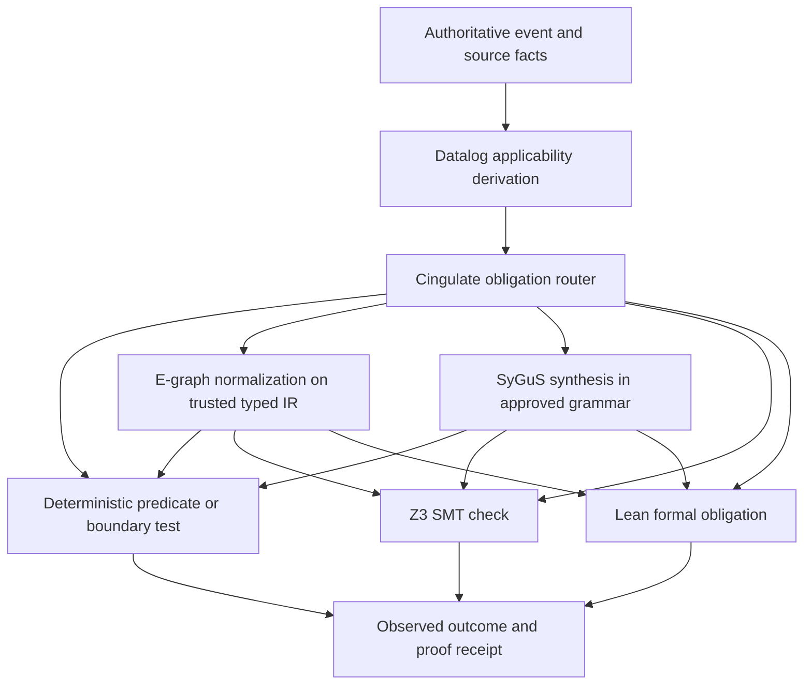

# Synthesis and Proof Backend Architecture

Status: Accepted target architecture; not a current capability claim  
Last updated: 2026-08-06

This document defines how The Athanor may normalize, synthesize, check, repair,
and promote generated structures without turning several useful formal tools
into one mandatory or self-authorizing pipeline.

## 1. Current boundary

The reference House does not currently integrate egg, egglog, Z3, SyGuS,
Wasmtime, or an online reinforcement-learning trainer. Incremental fact
maintenance, Cingulate, and Lean-backed lessons remain specified or planned as
described in [`RUNTIME_ARCHITECTURE.md`](./RUNTIME_ARCHITECTURE.md).

The decisions here accept:

- one bounded e-graph/egglog typed-IR research spike;
- Z3 as an optional Cingulate backend;
- an engine-neutral incremental Datalog contract;
- Wasmtime as one optional capability-sandbox profile;
- SyGuS as a bounded synthesis/repair backend;
- structured proof feedback with reviewed offline training data later;
- a governed propose/check/canary/promote self-improvement loop;
- pgvector HNSW as the semantic ANN implementation.

They reject a mandatory linear “fortress,” universal WASM, DDlog commitment,
native Rust HNSW, and self-approved installation.

## 2. Branching obligation routing

Formal tools are selected by obligation shape. They are not stages every action
must traverse.



The cheapest complete check runs first. A successful deterministic predicate
must not be replaced with a solver merely because a solver is available.

Every backend returns one uniform envelope:

```text
backend_kind
backend_version
obligation_id
input_schema_version
exact_input_refs
translation_or_codegen_digest
resource_profile_digest
status
artifacts
counterexample_or_error
started_at
completed_at
```

`unknown`, timeout, resource exhaustion, translation failure, and unsupported
input remain inconclusive. They never become proof.

## 3. E-graphs and egglog

### 3.1 Accepted use

The first e-graph work is a bounded research spike over one small typed
intermediate representation. Suitable domains include:

- arithmetic or Boolean policy expressions;
- Datalog rule-body canonicalization;
- query-expression normalization;
- proof-obligation simplification;
- small source-to-source transformations with an independently defined semantic
  contract.

Do not feed arbitrary Rust, TypeScript, Python, or model output into an e-graph
and claim semantic equivalence.

### 3.2 Rewrite authority

An e-graph proves only reachability under the supplied rewrites. Every rewrite
set therefore records:

```text
ir_schema_version
rewrite_set_version
rewrite_id
source and review authority
preconditions
typed left and right expressions
soundness evidence
applicable scopes
```

Generated rewrites remain candidates. They cannot join the active rewrite set
without review and regression evidence. One unsound rewrite can merge unequal
terms and poison every later extraction.

### 3.3 Extraction and bounds

Extraction is optimal only relative to an explicit cost function. Record the
cost function and its version alongside the extracted term.

Each run has hard limits for wall time, iterations, e-nodes, e-classes, rewrite
applications, memory, and output size. The receipt preserves saturation status,
applied rewrites, chosen expression, cost, and original expression.

The spike exits research only if it demonstrates:

- semantic equivalence against an independent oracle or shared case corpus;
- deterministic extraction under a versioned cost function;
- bounded behavior on adversarial rewrite sets;
- a measurable simplification or downstream proof benefit;
- clear failure without contaminating authority.

## 4. Z3 SMT backend

Z3 is an optional Cingulate backend for SMT-shaped obligations such as:

- bounded arithmetic and resource allocation;
- schedule and compatibility constraints;
- capability and configuration invariants;
- finite path conditions;
- existence of a policy-violating assignment.

Z3 proves properties of an encoded formula. It does not prove that the formula
accurately models the physical action, provider, program, or user intent.

A Z3 receipt records:

```text
formula and formula hash
source-fact IDs
translation version
solver build and configuration digest
logic and tactics
random seed
timeout and resource profile
sat | unsat | unknown | timeout | error
model or counterexample when sat
unsat core or proof artifact when available
```

For a safety obligation, the usual query asks whether a violation is
satisfiable. `unsat` supports the bounded claim; `sat` produces a counterexample;
`unknown` is inconclusive.

Cingulate selects Z3 only after Datalog has derived the applicable authoritative
policy. An SMT result cannot widen the policy or grant room authority.

## 5. Engine-neutral incremental Datalog

The Athanor preserves the existing engine-neutral contract:

- PostgreSQL/Git remain fact authority;
- source-linked additions and retractions advance `fact_epoch`;
- derived relations identify their supporting facts and rule versions;
- incremental results must equal a clean rebuild;
- authorization scope is part of fact projection and cache identity;
- lag, indexed commit, and overlay epoch remain visible.

No implementation is selected before measured load exists.

The first benchmark compares the smallest viable PostgreSQL or Rust
implementation against candidates such as egglog, differential dataflow, or
Soufflé. It uses identical fact deltas, queries, authority scopes, and resource
limits.

The benchmark reports correctness first, then:

- cold build and warm delta latency;
- peak and steady memory;
- deletion/retraction cost;
- rule/schema migration behavior;
- provenance quality;
- operational complexity;
- recovery from missing or out-of-order epochs.

DDlog is not an accepted implementation candidate because its official project
is archived. Soufflé remains a benchmark candidate for compiled static-analysis
loads, not a presumed streaming NATS substrate.

## 6. Syntax-Guided Synthesis

SyGuS is accepted as a bounded synthesis and repair backend for a small typed DSL
or IR. It does not directly manufacture universally optimal production Rust or
TypeScript.

A synthesis request contains:

```text
grammar and grammar version
logical specification
examples and counterexamples
allowed constants and operators
input/output types
explicit objective or cost, when optimization is required
resource profile
```

The safe lifecycle is:

```text
proposal
  -> governing authority approves grammar and specification
  -> cvc5 or compatible SyGuS solver synthesizes a term
  -> trusted code generator emits the target representation
  -> typecheck and ordinary compiler checks
  -> real-boundary tests and applicable Z3/Lean obligations
  -> capability sandbox
  -> canary
  -> observed outcome
  -> promotion or rejection
```

The synthesized term cannot alter its own grammar, specification, checker,
resource profile, code generator, or promotion policy.

Good first candidates include a state transition function, a policy predicate,
a bounded query rewrite, or a small evidence adapter. Generated application
features and repository-wide refactors are out of scope.

## 7. Proof-guided repair and training data

The near-term loop uses solver feedback without changing model weights:

```text
candidate
  -> checker
  -> structured counterexample or proof error
  -> bounded repair attempt
  -> checker
  -> stop at proof, attempt limit, repeated candidate, or resource limit
```

Every trajectory records candidate hashes, exact feedback, source facts, checker
versions, repair count, outcome, and review verdict. Repeated identical
candidates terminate the loop.

Reviewed trajectories may later form an offline training dataset. They are not
“un-gameable rewards.” A candidate can satisfy a flawed specification, exploit a
translation seam, or optimize the measured proxy while violating intent.

Any future training system is separate from the live inference runtime and
requires:

- dataset lineage, consent, license, and redaction;
- immutable train/validation/holdout splits;
- adversarial and regression suites;
- baseline comparison;
- shadow and canary deployment;
- rollback and revocation;
- prohibition on candidate changes to specifications, grammars, checkers, or
  evaluation data.

Online weight updates from live proof feedback are not accepted.

## 8. Governed self-improvement

The accepted furnace loop is:

```text
observe exact evidence
  -> GIGA proposes a baseline-aware refinement
  -> optional e-graph normalization or SyGuS repair
  -> Datalog derives obligations
  -> deterministic, Z3, and/or Lean checks
  -> capability sandbox
  -> bounded canary
  -> Cingulate records observed outcome
  -> governing authority promotes, rejects, or rolls back
```

GIGA cannot approve its own proposal. A proof backend cannot promote an artifact.
A successful canary does not silently widen deployment. Promotion names exact
scope, version, authority, rollout, rollback, and expiry conditions.

The candidate and production path remain separate until promotion. Failed and
rejected trajectories remain inspectable.

## 9. Wasmtime capability-sandbox profile

Wasmtime is one execution profile for WASM-compatible untrusted plugins,
deterministic transformations, and small logical helpers.

The manifest declares:

```text
module digest
WASM/component model version
entrypoint
allowed host imports
WASI filesystem preopens
network policy
clock/random policy
fuel and epoch limits
linear-memory, table, instance, and output limits
input/output schemas
secrets policy
```

Default capabilities are empty. The Host supplies only reviewed imports.
Cancellation terminates the Store and records an explicit outcome.

Workers that require Python, native compilers, GPU, subprocesses, broad project
files, or harness APIs use a bounded native, container, room, or future ANON
profile instead. Familiars are identities bound to lanes; they are not forced to
be WASM modules.

## 10. Retrieval boundary

pgvector HNSW remains the semantic approximate-nearest-neighbor lane. The
Athanor will use supported filters, partial indexes, partitions, iterative scans,
and multitenancy patterns before considering another ANN implementation.

Room and authorization policy is enforced before candidate visibility. Semantic
distance remains separate from authority, recency, source class, and
supersession, which enter attributed fusion and reranking.

A native Rust HNSW is reconsidered only after a reproducible benchmark shows a
pgvector ceiling at real corpus size and supported tuning cannot meet the
latency/recall target.

## 11. Non-goals

This architecture does not:

- guarantee that arbitrary generated code is true or optimal;
- treat SAT/UNSAT as proof that the real-world model is complete;
- let a candidate modify its judge;
- update model weights during live operation;
- require every obligation to traverse every backend;
- require every worker to run in WASM;
- replace PostgreSQL/Git authority with a solver or event stream;
- replace pgvector HNSW without measured evidence.

## 12. Related documents and sources

- [`RUNTIME_ARCHITECTURE.md`](./RUNTIME_ARCHITECTURE.md) — runtime phases and resource contracts
- [`HIPPOCAMPUS.md`](./HIPPOCAMPUS.md) — GIGA candidates and review lifecycle
- [`LESSONS.md`](./LESSONS.md) — typed lesson and proof-pattern contracts
- [`SECURITY.md`](./SECURITY.md) — trust and execution boundaries
- [egg](https://github.com/egraphs-good/egg)
- [egglog](https://github.com/egraphs-good/egglog)
- [Z3 Guide](https://microsoft.github.io/z3guide/docs/logic/intro/)
- [SyGuS](https://sygus.org/)
- [cvc5 SyGuS interfaces](https://cvc5.github.io/blog/2024/04/15/interfaces-for-understanding-cvc5.html)
- [Wasmtime security](https://docs.wasmtime.dev/security.html)
- [Soufflé](https://github.com/souffle-lang/souffle)
- [pgvector](https://github.com/pgvector/pgvector)
