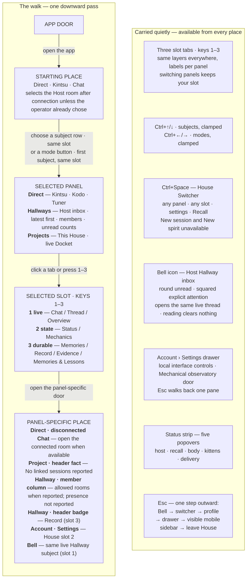
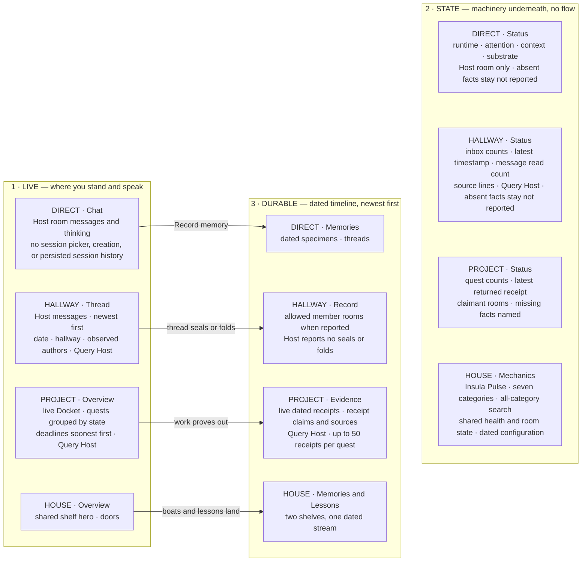

# GUI Prototype Navigation Map

This map describes the current prototype routes. `LESSONS_MAP.md` owns the interaction rules. Sources: `index.html`, `app.js`, and the instrument modules, reviewed on 2026-09-12.

Reading rule for the graphs: **every box is a place you can stand; every arrow is something you do** — except the second graph, where every arrow is sedimentation. One edge meaning per graph, never mixed.

## The walk

## The layers — and how live becomes durable

The arrows describe the intended durable model, not available write commands. Chat does not offer memory or boat writes. Hallway sealing and folding remain unavailable.

## The slot rule

Keys `1`–`3` are positional and semantic at once: slot 1 is always the live layer, slot 2 the state layer, slot 3 the durable layer; only the labels change per kind (`SUBJECT_VIEW_LABELS`). Switching subject or mode **keeps your slot** (`openConversation` never touches `activeView`). Only the switcher, inspector doors, and the hallway header badge set a slot explicitly.

| slot | layer | direct | hallway | project | house |
|---|---|---|---|---|---|
| 1 | live | Chat | Thread | Overview | Overview |
| 2 | state | Status | Status | Status | Mechanics |
| 3 | durable | Memories | Record | Evidence | Memories & Lessons |

Projects has one subject, `This House`. The board has no project or scope field. Slot 1 stays `Overview`.

## The two waists (machinery, out of the graphs)

1. **Subject/slot changes** — rows, tabs, number keys, inspector doors, header badge, switcher results, and Bell rows all resolve to `openSubjectView(view)` or `navigateToSubjectView(id, view)`; the Bell row uses the same waist through `openBoardFromBell()`. No door repaints the center directly.
2. **Visual changes** — every transition writes `state` and calls `render()`; one coordinated repaint of list, header, subject view, and inspector. The one-mantle rule (project lesson #405) lives here.

## Transition owners

| concern | owners |
|---|---|
| subject selection | `openConversation`, `openMode`, `toggleHouse`, `leaveHouse` |
| slot within subject | `openSubjectView`, `navigateToSubjectView`, `focusActiveSubjectView` |
| header facts | `renderSessionControl`; message count and connection state, not a session menu |
| sidebar drawer | `setDrawerView`, `openDrawerView`, `returnDrawerView`, `closeMobileSidebar` |
| inspector | `setInspector`, inspector doors via `renderInspectorDoors` |
| chat ring | `chat.js` queries snapshots and sends operator lines. It polls unanswered turns. `syncChatPanel` queries each live panel opening. |
| project Docket | `projects.js`: `queryProjects`, `projectMarkup`; `board/index.js` owns the shared reads |
| presence profile | `renderPresenceProfile`, `closePresenceProfile` |
| durable views | `renderRoomMemories`, `renderHallwayRecordView`, `renderDurableEntry`, `durableControls`, `durableEntries`, `renderDurableResults` |
| switcher | `openSwitcher`, `closeSwitcher`, `executeSwitcherCommand`, `switcherCommandRegistry` |
| Hallway Bell | `renderBellToggle`, `renderHallwayInbox`, `openBell`, `closeBell`, `openBoardFromBell`; rows come from `board/index.js` — `hallwayInboxRound` |
| Hallway subjects | `hallways.js` maps the shared inbox round. `board/hallway-messages.js` owns each message read. |
| House mechanics | `mechanics.js` renders categories and search. `mechanics-live.js` maps shared Host facts. Missing fields stay not reported. |
| Direct Status | `renderSubjectState` delegates direct rooms to `renderDirectStatus`. Only the Host's room has live status cards. |
| Insula Pulse | `pulse.js` — `renderHousePulse`, `queryPulseHost` via `ensurePulseQueried` (slot waists) and `handlePulseClick` (Query Host); lane trace drawer via `openLaneTrace`, `renderLaneTrace`, `renderWithLaneFocus` |
| House status | `health.js` owns health and room-state rounds. Page load queries both. `Query Host` refreshes both. Five footer channels remain. |
| composer | `updateComposerState`, `composerBlockReason`, `beginLocalResponse` |

## Keyboard doors

| key | effect | owner |
|---|---|---|
| `1`–`3` | slot within the current panel (outside inputs) | `openSubjectView` |
| `Ctrl/Cmd+↑/↓` | previous / next subject in the visible list, clamped; inert in House | subject-chord listener |
| `Ctrl/Cmd+←/→` | previous / next mode (Direct ↔ Hallways ↔ Projects), clamped; first subject, same slot | `openMode` via mode-chord listener |
| `Ctrl/Cmd+Space` | toggle House Switcher | `openSwitcher` / `closeSwitcher` |
| `Esc` | one step outward, in order: Bell → switcher → presence profile → drawer back → visible mobile sidebar → leave House | cascade listener |
| `Enter` / `Shift+Enter` | send / newline, per `sendWithEnter` setting | composer listeners |

## Asymmetries worth remembering

- **The House door toggles; everything else selects.** `toggleHouse` stashes `houseReturn`; Esc walks back out. A fourth panel kind with a return pointer, deliberately outside the list grammar.
- **The switcher is a router, not a surface.** Registry emits existing transitions; it never owns rendering. The Recall entry is live: it routes to House slot 3 and hands focus to the shelf search — the durable slot owns searching (`durableControls`, `renderDurableResults`), the switcher only opens the door.
- **Hallways use one subject per Host key.** The list and Bell open the same message surface. Reading clears nothing.
- **Session history is unavailable.** Direct has no session picker or creation callback. The switcher disables New session and states the missing Host capability.
- **Header verbs require real doors.** Hallway headers open Record. The composer states: `Watching only · no Hallway write door in this surface`.
- **Doors open; they never summon.** Projects reports no linked sessions or involved rooms. The Host has no involvement write door.
- **Chat does not offer continuity writes.** Live Chat hides Fold paper boat and Record memory. Disconnected Direct cannot submit messages.
- **The Bell is the authenticated presence's global router.** Selecting Kodo, Tuner, a Hallway, or a Project changes the subject in view and leaves Kintsu's Bell scope intact. An explicit embodied room/spirit switch may replace that scope. Hallway attention feeds the Bell today; future Project assignments, failures, and mentions use typed rows in the same inbox while subject rows and tabs retain contextual badges. Opening a result routes through the owning subject and acknowledges only covered rows.
- **Status channels stay separate.** Five buttons, five popovers, no combined verdict. Each chip carries one of five source states — not queried, querying, connected with a value, unreachable with the named reason, or not reported by the Host's health contract at all. `body` and `kittens` hold the last state permanently, because the absence is in the contract rather than in the round: a failed read never converts them into a zero. Every popover ends with the shared source line and the `Query Host` verb, so the reason for an unreachable Host is one click from the chip reporting it.
- **The status strip and the Account state block are one round, not two.** `health.js` owns a single `/live/health` read; the footer and the drawer both render from it, so the footer can never say `Host ok` while the drawer says `Offline`. The block also speaks the Host's insula reading in full, because a persistence fact with no visible door is an absent fact.
- **The lane is the trace drawer's door; there is no separate verb.** Clicking or keying a Pulse lane summary opens one drawer at a time — `pulse.js` owns the open state instead of the `
` element, so an async Host answer can re-render without collapsing the drawer it is filling, and focus returns to the lane it came from. The drawer states which of five things happened: no trace identity to ask with, reading, spans, zero rows for that trace in this room's scope, or the Host's own named refusal. A lane advertises `data-pulse-trace` only when its source actually carries a trace id, so the door is never offered where nothing stands behind it.

## Public Pages boundary

The public artifact preserves navigation and unavailable states. It has no Host connection, model calls, delivery, or persistence.
The builder publishes only reviewed browser modules and assets. It removes private telemetry and operator configuration.
Public names replace private fixture names in every app script. The disclosure remains visible outside the application shell.
Local prototype capabilities do not imply connected public capabilities. Main must build and browser-check `dist/pages/app/` before publication.
