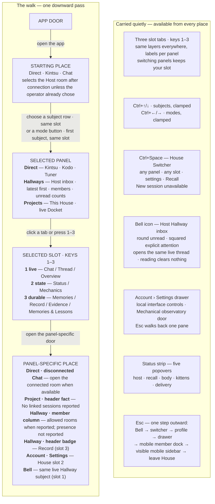
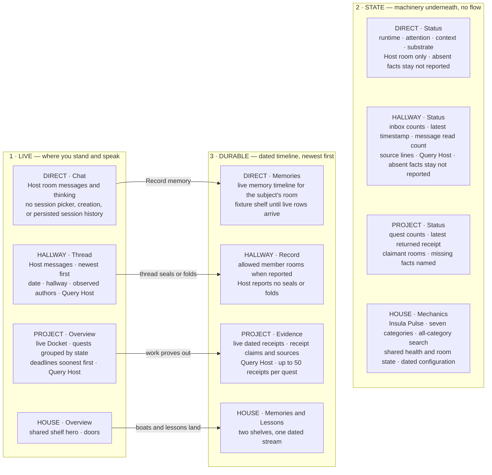

# GUI Prototype Navigation Map

This map describes the current prototype routes and the code that owns them. `LESSONS_MAP.md` owns the interaction rules. Verified against the code at commit `a6ab453` on 2026-10-04; a line marked `Not re-verified at a6ab453` was not. The Pulse section of [`ARCHITECTURE.md`](../docs/ARCHITECTURE.md#6-pulse) describes the proxy and the Host behind it.

Two servers carry these assets. `bun gui-prototype/serve.ts` serves this folder from disk (`serve.ts:77-81`).
`pulse.exe --serve-only` is a second server for the same assets: it embeds this folder and serves it without a window (`gui-desktop/src/main.rs:30,65-67`; `gui-desktop/src/proxy.rs:6-12`).

Reading rule for the graphs: **every box is a place you can stand; every arrow is something you do** — except the second graph, where every arrow is sedimentation. One edge meaning per graph, never mixed.

## The walk

```mermaid
flowchart LR

subgraph WALK["The walk — one downward pass"]
  direction TB
  door["APP DOOR"]
  start["STARTING PLACE<br>Direct · Kintsu · Chat<br>selects the Host room after connection unless the operator already chose"]
  panel["SELECTED PANEL<br><b>Direct</b> — Kintsu · Kodo · Tuner<br><b>Hallways</b> — Host inbox · latest first · members · unread counts<br><b>Projects</b> — This House · live Docket"]
  view["SELECTED SLOT · KEYS 1–3<br><b>1 live</b> — Chat / Thread / Overview<br><b>2 state</b> — Status / Mechanics<br><b>3 durable</b> — Memories / Record / Evidence / Memories & Lessons"]
  deeper["PANEL-SPECIFIC PLACE<br><b>Direct · disconnected Chat</b> — open the connected room when available<br><b>Project · header fact</b> — No linked sessions reported<br><b>Hallway · member column</b> — allowed rooms when reported; presence not reported<br><b>Hallway · header badge</b> — Record (slot 3)<br><b>Account · Settings</b> — House slot 2<br><b>Bell</b> — same live Hallway subject (slot 1)"]

  door -->|"open the app"| start
  start -->|"choose a subject row · same slot<br>or a mode button · first subject, same slot"| panel
  panel -->|"click a tab or press 1–3"| view
  view -->|"open the panel-specific door"| deeper
end

subgraph CARRY["Carried quietly — available from every place"]
  direction TB
  keys["Three slot tabs · keys 1–3<br>same layers everywhere, labels per panel<br>switching panels keeps your slot"]
  chords["Ctrl+↑/↓ · subjects, clamped<br>Ctrl+←/→ · modes, clamped"]
  switcher["Ctrl+Space — House Switcher<br>any panel · any slot · settings · Recall<br>New session unavailable"]
  bell["Bell icon — Host Hallway inbox<br>round unread · squared explicit attention<br>opens the same live thread · reading clears nothing"]
  drawer["Account › Settings drawer<br>local interface controls · Mechanical observatory door<br>Esc walks back one pane"]
  status["Status strip — five popovers<br>host · recall · body · kittens · delivery"]
  esc["Esc — one step outward:<br>Bell → switcher → profile → drawer<br>→ mobile member dock → visible mobile sidebar → leave House"]

  keys ~~~ chords ~~~ switcher ~~~ bell ~~~ drawer ~~~ status ~~~ esc
end

WALK ~~~ CARRY
```

Not re-verified at a6ab453: the door from a disconnected Direct Chat to the connected room. The Direct view markup in `app.js` decides.
Not re-verified at a6ab453: the round and squared count shapes. `app.js` sets the classes `is-unread` and `is-targeted` (`app.js:249-250`); `styles.css` draws the shapes, and no census covers it.

## The layers — and how live becomes durable

The arrows describe the intended durable model, not available write commands. Chat does not offer memory or boat writes. Hallway sealing and folding remain unavailable.

```mermaid
flowchart LR

subgraph LIVE["1 · LIVE — where you stand and speak"]
  direction TB
  dLive["DIRECT · Chat<br>Host room messages and thinking<br>no session picker, creation, or persisted session history"]
  hLive["HALLWAY · Thread<br>Host messages · newest first<br>date · hallway · observed authors · Query Host"]
  pLive["PROJECT · Overview<br>live Docket · quests grouped by state<br>deadlines soonest first · Query Host"]
  houseLive["HOUSE · Overview<br>shared shelf hero · doors"]
end

subgraph DUR["3 · DURABLE — dated timeline, newest first"]
  direction TB
  dDur["DIRECT · Memories<br>live memory timeline for the subject's room<br>fixture shelf until live rows arrive"]
  hDur["HALLWAY · Record<br>allowed member rooms when reported<br>Host reports no seals or folds"]
  pDur["PROJECT · Evidence<br>live dated receipts · receipt claims and sources<br>Query Host · up to 50 receipts per quest"]
  houseDur["HOUSE · Memories and Lessons<br>two shelves, one dated stream"]
end

subgraph STATE["2 · STATE — machinery underneath, no flow"]
  direction TB
  dState["DIRECT · Status<br>runtime · attention · context · substrate<br>Host room only · absent facts stay not reported"]
  hState["HALLWAY · Status<br>inbox counts · latest timestamp · message read count<br>source lines · Query Host · absent facts stay not reported"]
  pState["PROJECT · Status<br>quest counts · latest returned receipt<br>claimant rooms · missing facts named"]
  houseState["HOUSE · Mechanics<br>Insula Pulse · seven categories · all-category search<br>shared health and room state · dated configuration"]
end

dState ~~~ hState ~~~ pState ~~~ houseState

dLive -->|"Record memory"| dDur
hLive -->|"thread seals or folds"| hDur
pLive -->|"work proves out"| pDur
houseLive -->|"boats and lessons land"| houseDur

LIVE ~~~ DUR
DUR ~~~ STATE
```

Direct Memories reads `/live/memory/timeline` with the selected subject's room (`sediment/index.js:112`). The fixture shelf goes away when live rows arrive (`sediment/index.js:476,482`). [`LIMITATIONS.md`](../docs/LIMITATIONS.md#8-known-defects-in-the-current-code) names the room boundary.
Not re-verified at a6ab453: the House Overview contents, and the field lists of Hallway Status and Project Status. The `app.js` House renderer, `hallways.js`, and `projects.js` decide.

## The slot rule

Keys `1`–`3` are positional and semantic at once: slot 1 is always the live layer, slot 2 the state layer, slot 3 the durable layer; only the labels change per kind (`SUBJECT_VIEW_LABELS`). Switching subject or mode **keeps your slot** (`openConversation` never touches `activeView`; `app.js:593-615`).

These doors set a slot explicitly:

- The switcher, the inspector doors, and the Hallway header badge (`app.js:707-772, 521, 1679-1680`).
- The House door: `toggleHouse` sets slot 1 (`app.js:1600`), and `leaveHouse` restores the earlier slot (`app.js:1589`).
- A Bell row opens slot 1 (`app.js:690`).
- Account › Settings opens House slot 2 (`app.js:703`).

| slot | layer | direct | hallway | project | house |
|---|---|---|---|---|---|
| 1 | live | Chat | Thread | Overview | Overview |
| 2 | state | Status | Status | Status | Mechanics |
| 3 | durable | Memories | Record | Evidence | Memories & Lessons |

Projects has one subject, `This House`. Slot 1 stays `Overview`.
Not re-verified at a6ab453: the board rows have no project or scope field. The row shape in `board/index.js` decides.

Slot 3 reads dated records through named Host routes (census FaroPulseBoards R3, R9-R11). Hallway Record has no route (`hallways.js:64`).
Session, model, and Presence provenance show `Not reported` when the Host does not supply them (`app.js:1365-1367`).
Rule: House, spirit, Hallway, and project state keep separate authority, even when their rows look alike.

## The two waists (machinery, out of the graphs)

1. **Subject and slot changes.** Subject rows and `Ctrl+↑/↓` call `openConversation` (`app.js:1609-1611, 1998`). Mode buttons and `Ctrl+←/→` call `openMode` (`app.js:1631, 1988`). Tabs, number keys, inspector doors, the header badge, switcher results, and Bell rows call `openSubjectView(view)` or `navigateToSubjectView(id, view)`. The Bell row goes through `openBoardFromBell()` (`app.js:687-690`).
2. **Visual changes** — every transition writes `state` and calls `render()`; one coordinated repaint of list, header, subject view, and inspector. The one-mantle rule (project lesson #405) lives here.

## Transition owners

| concern | owners |
|---|---|
| subject selection | `openConversation`, `openMode`, `toggleHouse`, `leaveHouse` |
| slot within subject | `openSubjectView`, `navigateToSubjectView`, `focusActiveSubjectView` |
| header facts | `renderSessionControl`; message count and connection state, not a session menu |
| sidebar drawer | `setDrawerView`, `openDrawerView`, `returnDrawerView`, `closeMobileSidebar` |
| inspector | `setInspector`, inspector doors via `renderInspectorDoors` |
| chat ring | `chat.js` queries snapshots and sends operator lines. It polls unanswered turns. `syncChatPanel` queries each live panel opening. |
| project Docket | `projects.js`: `queryProjects`, `projectMarkup`; `board/index.js` owns the shared reads |
| presence profile | `renderPresenceProfile`, `closePresenceProfile` |
| durable views | `renderRoomMemories`, `renderHallwayRecordView`, `renderDurableEntry`, `durableControls`, `durableEntries`, `renderDurableResults` |
| switcher | `openSwitcher`, `closeSwitcher`, `executeSwitcherCommand`, `switcherCommandRegistry` |
| Hallway Bell | `renderBellToggle`, `renderHallwayInbox`, `openBell`, `closeBell`, `openBoardFromBell`; rows come from `board/index.js` — `hallwayInboxRound` |
| Hallway subjects | `hallways.js` maps the shared inbox round. `board/hallway-messages.js` owns each message read. |
| House mechanics | `mechanics.js` renders categories and search. `mechanics-live.js` maps shared Host facts. Missing fields stay not reported. |
| Direct Status | `renderSubjectState` delegates direct rooms to `renderDirectStatus`. Only the Host's room has live status cards. |
| Insula Pulse | `pulse.js` — `renderHousePulse`, `queryPulseHost` via `ensurePulseQueried` (slot waists) and `handlePulseClick` (Query Host). A lane opens its spans through `openLaneSpans` and `renderWithSpanFocus` (`pulse.js:163-224`). A span row opens the trace through `openLaneTrace`, `renderLaneTrace`, and `renderWithLaneFocus` (`pulse.js:113-116, 155, 231, 558`). |
| House status | `health.js` owns health and room-state rounds. Page load queries both. `Query Host` refreshes both. Five footer channels remain. |
| composer | `updateComposerState`, `composerBlockReason`, `beginLocalResponse` |

## Module ownership

The modules are native ES modules with no framework and no build step (`index.html:248`). Operator ruling, 2026-08-21: give an instrument its own module before the monolith becomes load-bearing.

| module | owns |
|---|---|
| `index.html` | the semantic shell; it loads `app.js` as a module (`index.html:248`) |
| `app.js` | fixtures, one state object, the render waist, transitions, and listeners (`app.js:66-93, 140-173, 1507`) |
| `board/index.js` | the Docket board, the Hallway inbox, evidence drawers, and its own source state (census FaroPulseBoards R1-R3, L1) |
| `board/hallway-messages.js` | one lazy drawer per Hallway row and one read per Hallway key (`board/hallway-messages.js:64, 72-73, 83`) |
| `sediment/index.js` | live memory and lesson timelines, full memory reads, keyset pagination, and per-shelf source state (census FaroPulseBoards R9-R11) |
| `pulse.js` | the stamped snapshot `PULSE_SNAPSHOT`, the live wire, and its own source state (`pulse.js:14-54, 671-673`) |
| `mechanics.js` | the source-census snapshot and the category, query, and scroll view state (`mechanics.js:23-25`) |
| `text.js` | `escapeHtml` (`text.js:6-8`) |
| `serve.ts` | Host access and the named Host routes, including chat submission (`serve.ts:41-65`) |

Each `init...` function takes `requestRender` and DOM handles once at boot (`app.js:2194-2211`). Each `handle...Click` function returns `true` when its module owned the event (`pulse.js:105-108`). The Bell, the switcher, the drawer, and the composer still live in `app.js` (`app.js:657, 828, 1394, 545`).

The bearer token stays in the proxy. `serve.ts` adds it (`serve.ts:60-63`), and `pulse.exe` adds it (`gui-desktop/src/proxy.rs:99`).
`serve.ts` has no `/local/repair` handler. Under `serve.ts`, the `repair.js` calls to `/local/repair/*` get 404 (`repair.js:16,30,35`; `serve.ts:77-80`). The repair routes live in `gui-desktop/src/proxy.rs:43-68`.
Pulse mixes live and fixture values. Live channels show the fixture retention of 14 days (`pulse.js:421`), and receipts always come from the fixture (`pulse.js:716`).

## Keyboard doors

| key | effect | owner |
|---|---|---|
| `1`–`3` | slot within the current panel (outside inputs) | `openSubjectView` |
| `Ctrl/Cmd+↑/↓` | previous / next subject in the visible list, clamped; inert in House | subject-chord listener |
| `Ctrl/Cmd+←/→` | previous / next mode (Direct ↔ Hallways ↔ Projects), clamped; first subject, same slot | `openMode` via mode-chord listener |
| `Ctrl/Cmd+Space` | toggle House Switcher | `openSwitcher` / `closeSwitcher` |
| `Esc` | one step outward, in order: Bell → switcher → presence profile → drawer back → mobile member dock → visible mobile sidebar → leave House (`app.js:2059-2096`) | cascade listener |
| `Enter` / `Shift+Enter` | send / newline, per `sendWithEnter` setting | composer listeners |

## Asymmetries worth remembering

- **The House door toggles; everything else selects.** `toggleHouse` stashes `houseReturn`; Esc walks back out. A fourth panel kind with a return pointer, deliberately outside the list grammar.
- **The switcher is a router, not a surface.** Registry emits existing transitions; it never owns rendering. The Recall entry is live: it routes to House slot 3 and hands focus to the shelf search — the durable slot owns searching (`durableControls`, `renderDurableResults`), the switcher only opens the door.
- **Hallways use one subject per Host key.** The list and Bell open the same message surface. Reading clears nothing.
- **Session history is unavailable.** Direct has no session picker or creation callback. The switcher disables New session and states the missing Host capability (`app.js:733-743`). New spirit is a disabled button in the sidebar collection (`app.js:882`). The switcher has no New spirit command.
- **Header verbs require real doors.** Hallway headers open Record. The composer states: `Watching only · no Hallway write door in this surface`.
- **Doors open; they never summon.** Projects reports no linked sessions or involved rooms. The Host has no involvement write door.
- **Chat does not offer continuity writes.** Live Chat hides Fold paper boat and Record memory. Disconnected Direct cannot submit messages.
- **The Bell reads the proxy's room, not a presence.** Pulse requests carry no person or presence identity, only the shared `hostToken` (`serve.ts:62`). The inbox request body is `{}` (census FaroPulseBoards R2, A1). The scope is the proxy's one room: `PULSE_ROOM`, default `kodo` (`serve.ts:34`; `gui-desktop/src/main.rs:53-77`). Selecting Kodo, Tuner, a Hallway, or a Project changes the subject in view, not the Bell scope. [`LIMITATIONS.md`](../docs/LIMITATIONS.md#4-identity) names the identity limit. Planned, no code: an explicit room or spirit switch may replace the scope, and Project rows may join the same inbox.
- **Status channels stay separate.** Five buttons, five popovers, no combined verdict. Each chip carries one of five source states — not queried, querying, connected with a value, unreachable with the named reason, or not reported by the Host's health contract at all. `body` and `kittens` hold the last state permanently, because the absence is in the contract rather than in the round: a failed read never converts them into a zero.
- **The status strip and the Account state block are one round, not two.** `health.js` owns a single `/live/health` read; the footer and the drawer both render from it, so the footer can never say `Host ok` while the drawer says `Offline`. The block also speaks the Host's insula reading in full, because a persistence fact with no visible door is an absent fact.
- **A lane opens its spans; a span opens its trace.** Lanes carry `data-pulse-lane` (`pulse.js:470`). A lane click opens that lane's recent spans (`pulse.js:172-224`). Span rows carry `data-pulse-span-trace` (`pulse.js:113, 550`). A span row click opens the trace drawer for that trace id (`pulse.js:113-116, 231`). The drawer has no missing-identity state (`pulse.js:229-231`).

Not re-verified at a6ab453: every status popover ends with the shared source line and the `Query Host` verb. `renderStatusStrip` in `app.js` and `statusChannel` in `health.js` decide.

## Sidebar drawer

- The drawer finds its panes through `data-drawer-pane`. One pane is `active`; earlier panes are `before`, later panes `after`. Inactive panes get `aria-hidden="true"` and `inert` (`app.js:192, 1400-1405`).
- Opening a pane records its trigger. Back and Escape move one pane outward (`app.js:1423-1425, 2076`).
- At the mobile root, Escape closes the visible sidebar before a later Escape leaves House (`app.js:2086-2095`).
- Focus waits for the pane animation and uses `preventScroll`. A generation token stops stale focus after fast navigation (`app.js:1411-1419`).
- Not re-verified at a6ab453: the drawer and track use `overflow: clip`, not `overflow: hidden`. `styles.css` decides. House memories #3565 and #3566 hold the Chromium discovery and repair.

## House mechanical observatory

- Account › Settings opens House slot 2 through `navigateToSubjectView("house", "state")` (`app.js:703`).
- The surface mixes two planes. It starts from the local source-census snapshot. `liveMechanic` replaces `Host offline` rows with `health.js` values (`mechanics-live.js:9`; applied at `mechanics.js:369`).
- Seven categories: Recall & Context; Memory, Lessons & Anamnesis; GIGA & Embeddings; Host, Delivery & Hallways; Rooms & Sessions; Backups; Advanced Guardrails (`mechanics.js:29, 75, 110, 155, 200, 252, 278`).
- Rows marked `Host-writable` show no mutation control (`mechanics.js:191, 435`).
- Not re-verified at a6ab453: nine metadata fields on every row; the category filter clears search; search crosses categories and keeps focus; secret rows show presence or health only. `mechanics.js` decides. The controls exist (`mechanics.js:424, 428`).
- Rule: when the Host connection lands, replace the local snapshot with the typed Host snapshot from project lesson #413, and delete duplicated client facts.
- Rule: project lesson #412 owns discoverability. A buried mechanical fact is absent from the operator's world.
- Rule: House Overview, Mechanics, and Memories & Lessons share one `1040px` outer canvas. A slot change must not make the House frame jump.

## Hallway Bell

- Rule: the Bell is the global door into Hallway attention. It adds no fourth mode and no second conversation surface.
- The Bell shows the inbox round that `board/index.js` already read (`app.js:254-261`). Bell rows are live Host reads (census FaroPulseBoards L1).
- Unread is the Host `unread` count. Attention is the Host `mentions` count (`app.js:267-268`). The button's accessible label carries both totals (`app.js:277, 291`).
- Unasked, refused, and caught-up are three named states. None shows a row (`app.js:259, 287-289`).
- A row names one Hallway. Its verb opens the Board for that Hallway (`app.js:687-690`).
- Reading the Bell acknowledges nothing on the client (census FaroPulseBoards R2). Host-side cursor behaviour is unknown.
- Selecting a Direct subject never speaks as that spirit. Chat refuses a room that is not the Host's room (`chat.js:52`).
- While a modal layer is open, the shell is `inert` and focus enters the first route. On close, focus returns to the invoking control (`app.js:660, 677, 847`).
- Hallway subjects come only from live reads. An empty subject is a placeholder, not data (`hallways.js:6, 8-16`).
- The footer and About keep the non-authoritative boundary (`app.js:103`).
- Rule: body-text parsing never creates recipient authority.
- Rule: invisible navigation must leave the keyboard and the accessibility tree.
- Not re-verified at a6ab453: the modal layer lives outside `.app-shell`. `index.html` decides.

## Status strip

- Local records stay simulated and non-authoritative (`app.js:1886-1888`).
- Rule: expanding one channel explains that channel. It never becomes a dashboard modal.
- Rule: a channel reports through the value, receipt, refusal, or unavailable action that owns it.
- Rule: published screenshots and handoffs add the disclosure outside the product anatomy.
- Rule: full-width hint and census banners have no interface owner. Delete them.

## Public Pages boundary

Not re-verified at a6ab453: this whole section. `scripts/build-pages.mjs` decides, and no census covers it.

The public artifact preserves navigation and unavailable states. It has no Host connection, model calls, delivery, or persistence.
The builder publishes only reviewed browser modules and assets. It removes private telemetry and operator configuration.
Public names replace private fixture names in every app script. The disclosure remains visible outside the application shell.
Local prototype capabilities do not imply connected public capabilities. Main must build and browser-check `dist/pages/app/` before publication.
